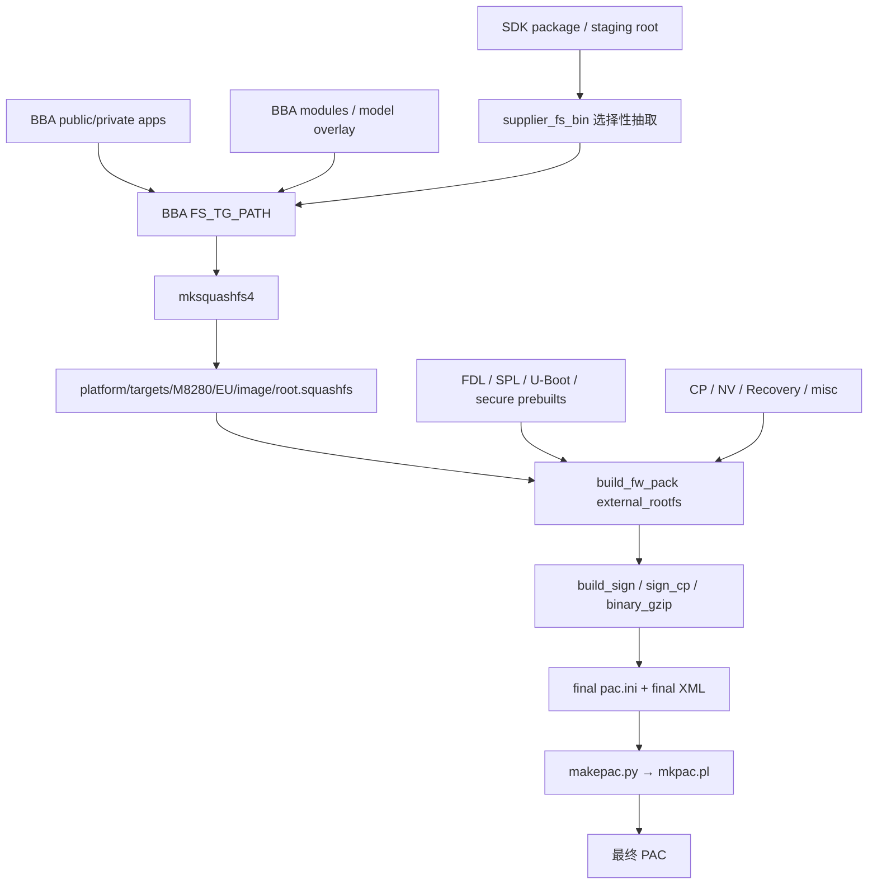
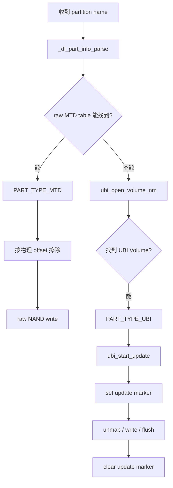

# M8280 / RG258UB_GLAB / UIS8510 / v610 完整刷机指南

> BBA 3.3.0 · Linux 6.6 · 1H10 NAND · 256 MiB SPI NAND  
> 面向：新接手工程师、平台维护者、刷机/启动问题排查人员

### 适用基线

| 项目 | 当前基线 |
|---|---|
| MODEL / SPEC | `M8280 / EU` |
| Quectel Project | `RG258UB_GLAB` |
| Revision | `RG258UB_GLABR01A01M4G` |
| SoC / Platform | `UIS8510 / v610` |
| Kernel | Linux 6.6 |
| Flash | 256 MiB SPI NAND |
| 正式工程根目录 | `/home/bba/work/bba/610/bba/3.3.0/bba_3_0_platform` |
| SDK Gold HEAD | `fc1b1da38c0b2ea9b327a3c8b7f744c2a96df4f0` |

#### 证据边界

本文只描述当前工程和已成功烧录现场能够确认的实现路径：

- **PAC 内容与打包链**：采用 2026-09-08 当前 BBA 3.3.0 构建快照。
- **下载、擦写与首次正常启动流程**：采用 2026-09-07 成功全量烧录的 QFlash 日志与 DBG UART 日志。
- **FDL2 内部实现**：采用当前 SDK HEAD 源码交叉验证。

两个构建/运行快照用于回答不同问题，不把它们的二进制 MD5 当成同一个现场。

本文不展开 OTA/FOTA、RIL、Wi-Fi 等与全量 PAC 刷机主链无关的功能。

#### 当前配置决定的设备侧实现路径

当前目标 `sdk/ql_rg620ua/unisoc/uboot44/configs/uis8510_1h10_nand_defconfig` 明确启用：

```text
CONFIG_NAND_BOOT=y
CONFIG_DM_MTD=y
CONFIG_MTD=y
CONFIG_MTD_UBI=y
CONFIG_UBI_ATTACH_MTD=y
CONFIG_NV_SUPPORT_GROUP=y
CONFIG_NV_SUPPORT_COMPRESS=y
```

因此本文围绕 **NAND + MTD + UBI + group NV** 这一条当前配置生效路径展开，不把 eMMC、非 UBI 或旧平台下载分支写进新人主线。

---

## 先读这一节：30 秒建立完整模型

刷机这件事可以压缩成一句话：

> **BBA/SDK 先把整机需要的镜像和分区描述打进 PAC；QFlash 把设备切进下载模式，装载 FDL/FDL2；FDL2 按分区表分别修改 raw NAND 和 `ubipac` 内的 UBI Volume；下载完成后设备 Reset，再从新写入的 Boot Chain、Kernel 和 RootFS 正常启动。**

```mermaid
flowchart LR
    A[BBA / SDK 构建] --> B[签名与物料汇聚]
    B --> C[PAC]
    C --> D[QFlash]
    D --> E[AT+QDOWNLOAD=1]
    E --> F[FDL / FDL2]
    F --> G[Repartition]
    G --> H{目标属于哪一层?}
    H -->|raw MTD| I[擦除 / 写 raw NAND]
    H -->|UBI Volume| J[UBI update / erase]
    I --> K[Reset]
    J --> K
    K --> L[Boot Chain]
    L --> M[U-Boot attach ubipac]
    M --> N[Kernel + system ID19]
    N --> O[/sbin/init → rcS → BBA Userspace]
```

理解本文最重要的是先分清 **三个存储层级**：

```text
256 MiB SPI NAND
│
├─ raw MTD 分区
│  ├─ splloader
│  ├─ sml
│  ├─ trustos
│  ├─ teecfg
│  ├─ uboot
│  ├─ logo
│  └─ ...
│
└─ ubipac  ← 它本身也是一个 raw MTD 分区
   │
   └─ UBI
      ├─ boot
      ├─ system
      ├─ recovery
      ├─ nr_modem
      ├─ rootfs_data
      ├─ misc_ro
      ├─ misc_rw
      └─ ...
```

所以：

- `sml`、`uboot` 是 **raw MTD**。
- `ubipac` 是承载 UBI 的 **raw MTD 容器**。
- `system`、`boot`、`rootfs_data` 是 **UBI Volume**，不是独立 MTD。
- 一个完整 PAC **绝不只是烧 mtd15/ubipac**，它同时更新 raw 启动区和 ubipac 内的多个 Volume。

---

## 1. PAC 到底是什么

### 1.1 PAC 的职责

当前 M8280 使用的 PAC 是一个**整机下载包**。它不只是“系统镜像”，而是把以下几类内容放在一个下载容器中：

1. 下载阶段执行环境：FDL、FDL2。
2. 早期启动与安全链：SPL、SML、TrustOS、TEE config、U-Boot。
3. Linux：`boot.img`、BBA `root.squashfs`、Recovery。
4. CP/Modem/NV：Modem、PHY、ADSP、NV 等。
5. BBA 初始化数据：`misc_ro.ubifs`、`misc_rw.ubifs`。
6. 下载控制信息：分区表、Logical ID、Block 映射、Erase 类操作。

当前最终 PAC：

```text
platform/targets/M8280/EU/image/
└─ uis8510_1h10_nand+tiny+console+sec+cpe-user-native_UIS8510_1H10_SEC.pac
```

当前构建快照：

```text
Size: 89,365,802 B
MD5:  32908ccb6e26669f86148afc2599a139
```

---

### 1.2 PAC 里的主要内容

下面只列当前最终 PAC 实际主项，不把源码树里未启用的历史分支混进来。

| 职责 | PAC Item | 当前 payload | 最终目标 | 作用 |
|---|---|---|---|---|
| 下载 | `FDL` | `fdl1-sign.bin` | 下载阶段 | 第一阶段下载 Loader |
| 下载 | `FDL2` | `fdl2-sign.bin` | 下载阶段 | 执行 repartition / erase / write |
| 早期启动 | `SPLLoader` | `u-boot-spl-16k-sign.bin` | raw `splloader` | SPL / early loader |
| 安全链 | `SML` | `sml-sign.bin` | raw `sml` | Secure Monitor 相关镜像 |
| 安全链 | `Trustos` | `tos-sign.bin` | raw `trustos` | TEE/TOS |
| 安全链 | `Teecfg` | `teecfg-sign.bin` | raw `teecfg` | TEE 配置 |
| Bootloader | `UBOOTLoader` | `u-boot-sign.bin` | raw `uboot` | U-Boot |
| 诊断 | `Sysdump` | `sysdump-sign.bin` | raw `sysdump` | 异常转储镜像 |
| 显示 | `BootLogo` | `quectel_logo.bmp` | raw `logo` | Boot Logo |
| Linux | `BOOT` | `boot-sign.img` | UBI `boot` ID18 | Normal boot image |
| Linux | `Recovery` | `boot-sign.img` | UBI `recovery` ID14 | Recovery boot image |
| RootFS | `System` | `root-sign.squashfs` | UBI `system` ID19 | BBA 只读根文件系统 |
| Recovery | `Recoveryfs` | `recovery-sign.squashfs` | UBI `recoveryfs` ID15 | Recovery RootFS |
| NV | `NV_NR_G` | `nvitem.bin` | UBI `nr_downloadnv` ID2 | NR 下载 NV / group NV 入口 |
| CP | `Modem_NR` | `cp_sign/...modem-sign.bin` | UBI `nr_modem` ID10 | NR Modem firmware |
| CP | `Modem_NR_DELTANV` | `cp_sign/...deltanv-sign.bin` | UBI `nr_deltanv` ID9 | Delta NV |
| CP | `Modem_NR_PHY` | `cp_sign/...PHY_modem-sign.bin` | UBI `nr_phy` ID11 | NR PHY firmware |
| CP | `DSP_LTE_AG` | `cp_sign/...adsp-sign.bin` | UBI `l_agdsp` ID12 | ADSP firmware |
| 平台固件 | `DFS` | `cp_sign/...UIS8510_SP-sign.bin` | UBI `pm_sys` ID13 | UIS8510 SP/平台固件 |
| BBA misc | `Misc_ro` | `misc_ro.ubifs` | UBI `misc_ro` ID22 | BBA misc 初始数据 |
| BBA misc | `Misc_rw` | `misc_rw.ubifs` | UBI `misc_rw` ID23 | BBA 可写 misc 初始数据 |
| BBA misc | `Misc_rw_bak` | `misc_rw.ubifs` | UBI `misc_rw_bak` ID24 | misc_rw 备份卷初始数据 |
| 其他 | `Mcufw` | `Project.bin` | XML `mcufw` Block | 当前 PAC 的 MCU/Project 下载项 |

#### PAC 还有一类“没有镜像文件”的 Item

这些 Item 本质上是下载指令，而不是 payload：

| Item | 目标 | 当前成功烧录中的作用 |
|---|---|---|
| `EraseSPLLoader` | raw `splloader` | 擦除 SPL raw 区 |
| `EraseUBOOTLOG` | UBI `uboot_log` ID16 | 清空 Volume |
| `EraseDumpstatus` | raw `dumpstatus` | 擦除 dump 状态区 |
| `EraseSysdumpdb` | UBI `sysdumpdb` ID17 | 清空 Volume |
| `EraseRootfs_data` | UBI `rootfs_data` ID20 | 清空可写数据区 |
| `EraseOem_data` | UBI `oem_data` ID21 | 清空 OEM 数据区 |
| `EraseLog` | UBI `log` ID25 | 清空日志卷 |

`EraseXXX` 不需要携带镜像。FDL2 收到 erase 命令后，直接对目标 raw MTD 或 UBI Volume 执行擦除/清空。

---

## 2. PAC 是怎么生成出来的

### 2.1 先记住构建链的分工

当前正式 BBA 固件不是“SDK 原生 RootFS 直接打包”。



这条链里最重要的边界是：

> **SDK `root-unisoc` 是 supplier runtime 来源，BBA `FS_TG_PATH` 才是当前产品最终 RootFS 的组装现场。**

#### 关键路径

```text
BBA RootFS 工作树:
platform/targets/M8280/EU/filesystem

BBA 最终 rootfs:
platform/targets/M8280/EU/image/root.squashfs

整机打包工作区:
sdk/ql_rg620ua/bin/unisoc/temp/
```

---

### 2.2 BBA RootFS → root.squashfs

BBA RootFS 主链：

```text
targets/fs.dir
  + supplier_fs_bin
  + BBA public/private apps
  + BBA modules
  + model filesystem overlay
        ↓
platform/targets/M8280/EU/filesystem
        ↓ mksquashfs4
platform/targets/M8280/EU/image/root.squashfs
```

随后 `image_build` 把这份 BBA rootfs 作为 external rootfs 交给 `build_fw_pack()`。

**源码/证据路径**

```text
platform/build/makes/Makefile.rootfs
platform/build/makes/Makefile.sdk.quecopen_rg620ua.mk
platform/build/model/M8280/EU/exfiles/ql_build_config
```

---

### 2.3 boot.img 从哪里来

当前 v610 target 选择：

```text
DEVICE_DTS = sprd/uis8510-1h10-nand
```

Kernel 侧生成：

```text
Image.gz + DTB
        ↓ Build/make-boot-img
DTB → dt.img
+ dummy ramdisk
+ Unisoc boot header
        ↓ mkkernelimg.py
boot.img
```

所以：

- `boot.img` 承载 Kernel/DTB 启动内容。
- **真正的产品 RootFS 不在 boot.img 里**。
- 产品 RootFS 是独立的 `root.squashfs`，最终写入 UBI `system` ID19。

**源码路径**

```text
sdk/ql_rg620ua/target/linux/unisoc/image/v610.mk
sdk/ql_rg620ua/target/linux/unisoc/image/mkkernelimg.py
sdk/ql_rg620ua/unisoc/linux/kernel_6.6/arch/arm64/boot/dts/sprd/uis8510-1h10-nand.dts
```

---

### 2.4 build_fw_pack 做的不是“只打一个 PAC”

`build_fw_pack()` 是整机物料汇聚器。它会把多个来源收进：

```text
sdk/ql_rg620ua/bin/unisoc/temp/
```

当前现场可见的典型物料：

```text
fdl1.bin / fdl1-sign.bin
fdl2.bin / fdl2-sign.bin
u-boot-spl-16k.bin / ...-sign.bin
u-boot.bin / u-boot-sign.bin
sml.bin / sml-sign.bin
teecfg.bin / teecfg-sign.bin
tos.bin / tos-sign.bin
sysdump.bin / sysdump-sign.bin
boot.img / boot-sign.img
root.squashfs / root-sign.squashfs
recovery.squashfs / recovery-sign.squashfs
nvitem.bin
misc_ro.ubifs
misc_rw.ubifs
Project.bin
...
```

当前 M8280 的长期配置源：

```text
platform/build/model/M8280/EU/exfiles/ql_build_config
```

构建时覆盖至：

```text
sdk/ql_rg620ua/quectel/unisoc/compile/ql_build_config
```

当前两者 MD5 一致，说明正式 BBA model 文件就是当前 `build_fw_pack / build_pac / build_sign` 逻辑的配置源。

---

### 2.5 Partitions.ini、final pac.ini、Partitions.xml 各管什么

这是理解 PAC 映射最关键的一节。

#### `Partitions.ini`：选择“这次 PAC 要带哪些 Logical Item”

当前模板：

```text
platform/build/model/M8280/EU/partitions/Partitions.ini
```

它支持多个 project/security variant。当前构建命中：

```text
uis8510_1h10_nand+tiny+console+sec+cpe-user-native
    → UIS8510_1H10_SEC
```

`parser_ini.py` 由此实例化出当前最终：

```text
sdk/ql_rg620ua/bin/unisoc/temp/cp_sign/UIS8510_1H10_SEC/pac.ini
```

这份 **final pac.ini 才是当前 PAC 真正的 Item/payload 清单**。

#### `Partitions.xml`：定义 Logical Item 最终落到哪个 Block/Partition

当前打包现场 XML：

```text
sdk/ql_rg620ua/bin/unisoc/temp/uis8510-1h10-nand-cpe.xml
```

其中定义：

- Scheme 中 Logical ID → Block。
- UBI Volume 名称与容量。
- raw/UBI 对应关系。

例如 `System`：

```text
root-sign.squashfs
        ↓
final pac.ini: System=1@.../root-sign.squashfs
        ↓
XML: ID=System → Block=system
        ↓
ubipac / UBI Volume system (ID19)
```

#### 最终映射心智模型

```text
实际文件
  ↓
final pac.ini 的 PAC Item
  ↓
Partitions.xml 的 File / Block
  ↓
raw MTD 或 ubipac 内 UBI Volume
```

---

### 2.6 最终 PAC 打包主链

当前 `build_pac()` 的主链可归纳为：

```text
parser_ini.py
  ↓
sign_cp.sh
  ↓
update_nv_pac_config.sh       [文件存在时执行]
  ↓
binary_gzip
  ↓
makepac.py
  ↓
mkpac.pl
  ↓
*.pac
```

其中：

- `parser_ini.py`：生成当前 variant 的 final `pac.ini`。
- `sign_cp.sh`：生成 CP/Modem signed payload，并把 final pac.ini 对应路径改到 signed 文件。
- `binary_gzip()`：对当前配置要求压缩的 payload 处理。
- `makepac.py / mkpac.pl`：组织 XML、final pac.ini 和 payload，最终形成 PAC 容器。

**关键源码路径**

```text
platform/build/model/M8280/EU/exfiles/ql_build_config::build_pac()
sdk/ql_rg620ua/unisoc/prebuilts/scripts/packimage_scripts/sign_cp.sh
sdk/ql_rg620ua/unisoc/prebuilts/scripts/packimage_scripts/makepac.py
sdk/ql_rg620ua/unisoc/prebuilts/scripts/packimage_scripts/mkpac.pl
```

---

## 3. QFlash 真正是怎么把 PAC 烧进 NAND 的

### 3.1 第一阶段：从正常系统切到下载模式

成功 QFlash 日志：

```text
15:22:36  Port(89) is AT port
15:22:36  at+qdownload=1
15:22:36  Switch Download Port success...
15:22:38  AT Port not exist[PASS]
15:22:49  SPRD U2S DIAG / New Qdloader 1: 88
15:22:51  AT(89)->QDownload(88)
```

实际过程：

1. QFlash 找到当前正常系统的 `Quectel USB AT Port`。
2. 发送 `AT+QDOWNLOAD=1`。
3. 正常 AT 设备消失。
4. USB 重新枚举为 `SPRD U2S DIAG`。
5. QFlash 在新下载口继续后续流程。

当前 QFlash 摘要没有单独打印名为 `BootROM handshake` 的阶段，因此本文只使用可观测的 QFlash 阶段名，不补写闭源内部协议。

---

### 3.2 第二阶段：FDL / FDL2 建立设备侧下载环境

QFlash：

```text
15:22:51  DL Start
15:22:51  FDL
15:22:52  FDL2
```

设备 DBG UART：

```text
15:22:54  do_download:enter
15:22:54  dl_prepare_init:enter
15:22:55  dl_cmd_handler:enter
```

这两个 Loader 与普通固件镜像不同：

- 它们用于**建立下载执行环境**。
- 不对应一个普通 raw MTD/UBI Volume 的“最终常驻内容”。
- FDL2 进入下载命令后，才开始真正处理 repartition / erase / write / reset。

当前设备侧主入口：

```text
U_BOOT_CMD("download")
  → do_download()
    → dl_prepare_init()
      → dl_packet_init()
      → fdl_ubi_dev_init()       [NAND]
    → dl_register_func()
    → dl_ackpkt_init()
    → dl_cmd_handler()
      → dl_get_packet()
      → 按 packet.body.type 分派 handler
```

**源码路径**

```text
sdk/ql_rg620ua/unisoc/uboot44/arch/arm/mach-sprd/dloader/cmd_download.c
```

---

### 3.3 第三阶段：NV backup / Integrity Check / Repartition

QFlash：

```text
15:22:55  _BKF_NV_NR_G
15:22:58  _INTEGRITY_CHECK_
15:22:58  _REPARTITION_
```

设备：

```text
_parse_repartition_header: version(1), unit(2), ...
volume name: prodnv ...
volume name: project_RG258UB_GLAB ...
...
volume name: log,size:0x100000,autoresize flag:1
```

这里发生了两件非常重要的事。

#### 1）Host 把当前分区表下发给 FDL2

设备侧不解析 PAC/XML 本身，而是收到 QFlash 转换后的 **repartition binary payload**：

```text
BSL_REPARTITION
  → dl_cmd_repartition()
  → _parse_repartition_header()
  → dl_repartition()
  → parser_repartition_cfg()
  → _dl_vtbl_check()
```

#### 2）FDL2 根据新旧 Volume 表决定要不要重建 UBI

源码存在三类结果：

```text
PART_SAME
  → Volume 布局相同，不重建

PART_DIFF
  → 删除有变化/多余的 Volume，再创建目标 Volume

PART_FAIL
  → 擦除整个 ubipac raw MTD
  → 重新 attach UBI
  → 全量创建目标 Volume
```

当前成功日志最终得到 **26 个 user Volume，ID 0~25**。

> 这里的“26”来自 Host 下发的当前分区表，不是 FDL2 里写死的常量。

**源码路径**

```text
sdk/ql_rg620ua/unisoc/uboot44/arch/arm/mach-sprd/dloader/dl_cmd_proc.c
sdk/ql_rg620ua/unisoc/uboot44/arch/arm/mach-sprd/dloader/dl_nand_operate.c
```

---

### 3.4 FDL2 如何判断“这是 raw MTD 还是 UBI Volume”

这是整个烧录原理最关键的分支。



代码先查 raw MTD table：

```text
_get_mtd_partition_info(part)
```

找不到时日志会打印：

```text
get mtd part info: "system" is not a mtd partition.
```

随后尝试：

```text
ubi_open_volume_nm(..., "system", UBI_READWRITE)
```

成功后：

```text
Volume "system" found at volume id 19
```

因此：

> **`system is not a mtd partition` 是正常的分层查找日志，不是刷机错误。**

---

### 3.5 raw MTD 是怎么擦、怎么写的

raw MTD 目标包括：

```text
splloader / sml / trustos / teecfg / sysdump / dumpstatus / uboot / logo ...
```

#### raw erase

调用链：

```text
BSL_ERASE_FLASH
  → dl_cmd_erase()
  → dl_erase()
  → _dl_mtd_part_erase()
  → nand_erase_opts()
  → mtd_block_isbad()
  → mtd_erase()
```

本次 NAND：

```text
PEB = 0x20000 = 128 KiB
```

成功日志的 erase offset 正好按 `0x20000` 步进。

#### raw write

调用链：

```text
BSL_CMD_MIDST_DATA / END_DATA
  → dl_download_midst() / dl_download_end()
  → _dl_nand_write()
  → dl_nand_write_mtd()
  → part_write_skip_bad()
  → nand_write_skip_bad()
```

典型 SML 日志：

```text
fdl2_download_start:part:sml,size:0x4c698
Erasing at 0x100000 ... 0x1a0000 -- 100%
Erasing at 0x1c0000 ... 0x260000 -- 100%
dl nand write:partname:sml,    offset:0x100000, len:0x4c698
_dl_nand_write:partname:smlbak,offset:0x1c0000, len:0x4c698
```

这说明当前 SML 一个 PAC Item 会更新：

```text
sml + smlbak
```

TrustOS、TEE config、U-Boot 也出现同样模式。

---

### 3.6 为什么 PAC 只有主镜像，但 raw 主/备都会被写

当前源码中 NAND backup 路径会检查主分区是否存在对应 `bak` 分区：

```text
sml       → smlbak
trustos   → trustosbak
teecfg    → teecfgbak
uboot     → ubootbak
```

当 backup 机制生效时，同一个 Host 数据流会建立：

```text
主分区下载状态 + backup 分区下载状态
```

然后同一 payload 分别写入两处。

调用关系：

```text
dl_cmd_write_start(main)
  → check_part_with_bak_ab(main)
  → dl_download_start(main + "bak")
  → dl_download_start(main)

MIDST / END
  → _dl_nand_write()
  → dl_nand_write_mtd(main)
  → dl_nand_write_mtd(backup)
```

成功日志已经直接证明当前实际构建确实产生了：

```text
sml/smlbak
trustos/trustosbak
teecfg/teecfgbak
uboot/ubootbak
```

#### SPL 是特殊情况

`SPLLoader` 不走普通 raw writer：

```text
_dl_nand_write()
  → sprd_nand_write_spl()
  → "write spl pass!"
```

因此本文只确认 SPL 使用专用 NAND SPL 写入路径，不把普通 `main + bak` 规则强行套到 `splloaderbak` 的底层实现。

---

### 3.7 UBI Volume 是怎么擦、怎么写的

以 `system` 为例：

```text
get mtd part info: "system" is not a mtd partition.
fdl2_download_start:part:system,size:0xee0338
Volume "system" found at volume id 19
set update marker for volume 19
...
clear update marker for volume 19
```

UBI 普通更新：

```text
dl_download_start()
  → fdl_ubi_volume_start_update(volume, image_size)
  → ubi_start_update()
    → set_update_marker()
    → unmap 该 Volume 现有 LEB
  → fdl_ubi_volume_write()
  → ubi_more_update_data()
  → flush
  → clear_update_marker()
```

UBI 的 `EraseXXX` 更简单：

```text
fdl_ubi_volume_start_update(volume, 0)
  → ubi_start_update(..., 0)
  → unmap / wipe
  → flush
  → clear_update_marker()
```

所以：

- `System`、`BOOT`、`Modem_NR` 等带 payload，会“清旧数据 + 写新数据”。
- `EraseRootfs_data`、`EraseOem_data`、`EraseLog` 等无 payload，只负责“清空 Volume”。

#### update marker 的意义

写入开始先置 marker，写完才清 marker。

这避免设备把**更新到一半**的 Volume 当成完整有效数据使用。

**源码路径**

```text
sdk/ql_rg620ua/unisoc/uboot44/arch/arm/mach-sprd/dloader/dl_ubi.c
sdk/ql_rg620ua/unisoc/uboot44/drivers/mtd/ubi/upd.c
```

---

### 3.8 当前一次全量烧录的真实顺序

| 时间 | QFlash 阶段 | 实际动作 | Flash 层级 |
|---|---|---|---|
| 15:22:51 | FDL / FDL2 | 建立下载执行环境 | 非普通分区 |
| 15:22:55 | `_BKF_NV_NR_G` | NV backup / group NV 前置阶段 | UBI/NV |
| 15:22:58 | `_INTEGRITY_CHECK_` | Host 完整性检查 | 校验 |
| 15:22:58 | `_REPARTITION_` | 下发当前 26-Volume 布局 | ubipac / UBI |
| 15:22:59 | `EraseSPLLOADER / NV_NR_G` | 擦 SPL、处理下载 NV | raw + UBI |
| 15:23:05 | `SML / Trustos` | 安全链镜像 | raw 主/备 |
| 15:23:08 | `Teecfg / UBOOTLoader` | TEE 配置、U-Boot | raw 主/备 |
| 15:23:09 | `Sysdump / EraseDumpstatus / BootLogo` | 诊断与 Logo | raw |
| 15:23:11 | `BOOT` | Normal boot image | UBI ID18 |
| 15:23:14 | `System` | BBA RootFS | UBI ID19 |
| 15:23:21 | `Recovery` | Recovery boot | UBI ID14 |
| 15:23:24 | `Sysdumpdb / Modem_NR` | 运行区 + Modem | UBI |
| 15:23:29 | `DeltaNV / PHY` | CP payload | UBI |
| 15:23:31 | `ADSP / DFS / Recoveryfs` | 平台/Recovery | UBI |
| 15:23:35 | `rootfs_data / oem_data / misc_*` | 清运行区、写 BBA misc | UBI |
| 15:23:36 | `EraseLog / Mcufw` | 清日志、Project/MCU Item | UBI/特殊 Block |
| 15:23:41 | `SPLLoader` | SPL 专用写入 | raw |
| 15:23:41 | `_RESET_` | 下载结束 | Reset |
| 15:23:41 | `Download Successful` | QFlash 判定下载完成 | Host |
| 15:23:51 | `FW upgrade success` | QFlash 收尾 | Host |

---

## 4. 烧录完成后，设备为什么能启动起来

### 4.1 Reset 后重新走正常 Boot Chain

QFlash：

```text
15:23:41  _RESET_
15:23:41  Download Successful.
15:23:41  Reset...
```

随后 DBG UART 立即重新出现：

```text
15:23:46  ddr init start
15:23:46  Enter nand_boot
15:23:46  PHASE_FLASH_INIT
15:23:48  PHASE_VERIFY_TEE
15:23:48  PHASE_VERIFY_SML
15:23:48  PHASE_VERIFY_TOS
15:23:48  PHASE_LOAD_BOOTLOADER
15:23:48  Jump to SML
15:23:49  U-Boot 2023.01
```

也就是说：

> **刷机完成后的 Reset 不是继续运行 FDL2，而是重新从 NAND 上的新启动链开始启动。**

---

### 4.2 U-Boot 重新识别 NAND、MTD、UBI

当前成功日志：

```text
nand id is c2 a6 3 0
256 MiB
ubi init start
boot NORMAL
ubi0: attached ... (name "ubipac", size 232 MiB)
ubi0: PEB size: 131072 bytes
ubi0: LEB size: 126976 bytes
ubi0: good PEBs: 1862, bad PEBs: 0
ubi0: user volume: 26
ubi0: PEBs reserved for bad PEB handling: 40
```

这一步把刚刚烧好的 `ubipac` 再次 attach 成 UBI，并看到当前 26 个逻辑卷。

---

### 4.3 Normal boot 最终从哪个 Volume 启动

关键启动参数：

```text
BOOT_SLOT = NORMAL
init=/sbin/init
ubi.block=0,19
root=/dev/ubiblock0_19
rootfstype=squashfs ro rootwait
```

所以当前正常系统的关系是：

```text
UBI Volume system (ID19)
        ↓
ubiblock0_19
        ↓
SquashFS
        ↓
/
```

这就是为什么当前分区设计中 **system 必须保持 ID19**：Kernel cmdline 已直接绑定 `ubi.block=0,19` 与 `root=/dev/ubiblock0_19`。

---

### 4.4 `/sbin/init → rcS → BBA Userspace`

当前正式 BBA RootFS 的入口：

```text
/sbin/init
```

不是 SDK Demo 的 `/etc/preinit`。

BBA 在 RootFS 组装阶段把 model 的启动文件注入最终 filesystem：

```text
platform/build/model/M8280/EU/inittab
platform/build/model/M8280/EU/rcS
platform/build/model/M8280/EU/rcS.quecopen_rg620ua
```

最终用户态主线：

```text
/sbin/init
  → /etc/inittab
  → /etc/init.d/rcS
  → /etc/init.d/rcS.quecopen_rg620ua
  → mount 各运行卷
  → supplier/BBA services
```

成功启动日志：

```text
mounted rootfs_data -> /rootfs_data
mounted oem_data    -> /oem_data
mounted log         -> /log
mounted prodnv      -> /etc/productinfo
mounted misc_ro     -> /var/run/misc/misc_ro
mounted misc_rw     -> /var/run/misc/misc_rw
mounted misc_rw_bak -> /var/run/misc/misc_rw_bak
ubivol_link done
...
rcS.sdk init done!
```

---

### 4.5 “刷机完成”不等于“所有运行数据已经存在”

需要区分三类数据：

#### A. PAC 直接写入的固定镜像

例如：

```text
SML / TrustOS / U-Boot / boot / system / modem / recoveryfs
```

#### B. PAC 写入“初始文件系统”的 Volume

例如：

```text
misc_ro.ubifs → misc_ro
misc_rw.ubifs → misc_rw
misc_rw.ubifs → misc_rw_bak
```

#### C. PAC 只清空、运行后再产生内容的 Volume

例如：

```text
rootfs_data
oem_data
log
sysdumpdb
```

这些数据会在系统启动后由服务、应用或运行状态逐渐生成。

---

## 5. 当前 Flash 布局速查

### 5.1 外层 raw MTD

| MTD | 名称 | Offset | Size |
|---:|---|---:|---:|
| 0 | `splloader` | `0x00000000` | 512 KiB |
| 1 | `splloaderbak` | `0x00080000` | 512 KiB |
| 2 | `sml` | `0x00100000` | 768 KiB |
| 3 | `smlbak` | `0x001c0000` | 768 KiB |
| 4 | `trustos` | `0x00280000` | 4 MiB |
| 5 | `trustosbak` | `0x00680000` | 4 MiB |
| 6 | `teecfg` | `0x00a80000` | 512 KiB |
| 7 | `teecfgbak` | `0x00b00000` | 512 KiB |
| 8 | `sysdump` | `0x00b80000` | 1 MiB |
| 9 | `dumpstatus` | `0x00c80000` | 256 KiB |
| 10 | `uboot` | `0x00cc0000` | 3 MiB |
| 11 | `ubootbak` | `0x00fc0000` | 3 MiB |
| 12 | `rawdata` | `0x012c0000` | 768 KiB |
| 13 | `custinfo` | `0x01380000` | 768 KiB |
| 14 | `logo` | `0x01440000` | 3 MiB |
| 15 | `ubipac` | `0x01740000` | 232.75 MiB |

前 15 个 raw 分区合计 23.25 MiB；其余大部分 NAND 空间由 `ubipac` 接管。

---

### 5.2 ubipac 内当前 26 个 UBI Volume

| ID | Volume | 当前 XML Size | 刷机行为 |
|---:|---|---:|---|
| 0 | `prodnv` | 5120 KiB | NV 特殊流程 |
| 1 | `project_RG258UB_GLAB` | 256 KiB | project/erase |
| 2 | `nr_downloadnv` | 5120 KiB | `NV_NR_G` |
| 3 | `nr_factorynv` | 3840 KiB | NV group |
| 4 | `calinv` | 3840 KiB | NV group |
| 5 | `nr_runtimenv1` | 10240 KiB | NV group |
| 6 | `nr_runtimenv2` | 10240 KiB | NV group backup |
| 7 | `miscdata` | 1024 KiB | 运行/下载状态 |
| 8 | `misc` | 1024 KiB | 系统 misc |
| 9 | `nr_deltanv` | 1024 KiB | `Modem_NR_DELTANV` |
| 10 | `nr_modem` | 15360 KiB | `Modem_NR` |
| 11 | `nr_phy` | 8192 KiB | `Modem_NR_PHY` |
| 12 | `l_agdsp` | 5120 KiB | `DSP_LTE_AG` |
| 13 | `pm_sys` | 512 KiB | `DFS` |
| 14 | `recovery` | 8192 KiB | `Recovery` |
| 15 | `recoveryfs` | 5120 KiB | `Recoveryfs` |
| 16 | `uboot_log` | 1024 KiB | `EraseUBOOTLOG` |
| 17 | `sysdumpdb` | 3072 KiB | `EraseSysdumpdb` |
| 18 | `boot` | 8192 KiB | `BOOT` |
| 19 | `system` | 19456 KiB | `System` |
| 20 | `rootfs_data` | 61876 KiB | `EraseRootfs_data` |
| 21 | `oem_data` | 10240 KiB | `EraseOem_data` |
| 22 | `misc_ro` | 10292 KiB / 83 LEB | `Misc_ro` |
| 23 | `misc_rw` | 10292 KiB / 83 LEB | `Misc_rw` |
| 24 | `misc_rw_bak` | 10292 KiB / 83 LEB | `Misc_rw_bak` |
| 25 | `log` | `0xFFFFFFFF` | `EraseLog` + autoresize |

当前 UBI 几何：

```text
PEB             = 131072 B  (128 KiB)
LEB             = 126976 B  (124 KiB)
Min I/O         = 2048 B
Good PEBs       = 1862
Bad PEBs        = 0          [本次成功烧录现场]
Reserved for bad= 40 PEB
User volumes    = 26
```

---

## 6. 其他机制与常见问题

这一章专门放不影响主链理解、但排查时经常会问到的问题。

### 6.1 为什么 `log` 在 XML 里是 `0xFFFFFFFF`

当前源码定义：

```c
#define AUTO_RESIZE_FLAG 0xFFFFFFFF
```

FDL2 解析到该值时不会创建一个“4 GiB Volume”，而是：

```text
0xFFFFFFFF
  → 识别为 AUTO_RESIZE_FLAG
  → 先按 1 MiB 建立 Volume
  → 标记 autoresize=1
  → 所有固定 Volume 建好后
  → 用剩余可用 PEB 扩展 log
```

当前成功日志直接打印：

```text
volume name:log,size:0x100000,autoresize flag:1
```

源码链：

```text
dl_parse_volume_cfg()
  → fdl_ubi_create_vol(..., 1 MiB)
  → fdl_ubi_volume_autoresize()
```

---

### 6.2 NV_NR_G 为什么会同时动多个 NV Volume

当前 target 明确：

```text
CONFIG_NV_SUPPORT_GROUP=y
```

所以 `NV_NR_G / nr_downloadnv` 不是普通“单 Volume 镜像写入”。

设备侧 group NV 主链：

```text
nr_downloadnv image
  → dl_nand_write_nv_img()
  → dl_nand_write_grpnv_img()
    → nand_write_factorynv()
      → nr_factorynv + calinv
    → nand_write_runtimenv()
      → nr_runtimenv1 + nr_runtimenv2
    → nand_write_nvpart()
      → nr_downloadnv
```

这与成功日志中 `NV_NR_G` 阶段连续访问：

```text
calinv
nr_factorynv
nr_runtimenv1
nr_runtimenv2
nr_downloadnv
```

完全一致。

final `pac.ini` 还存在：

```text
NvBackup=1
```

但该字段在设备侧 dloader 源码中没有直接消费者；其 Host 侧内部策略不在本文扩展解释范围。

---

### 6.3 坏块是怎么处理的

#### raw NAND erase

每个 eraseblock 擦除前：

```text
mtd_block_isbad()
```

已标坏块会被跳过。

#### raw NAND write

`part_write_skip_bad()` 会跳过已标坏块；如果当前块写失败，代码可调用 `_block_markbad()` 将对应 eraseblock 标坏。

#### UBI

UBI attach 会扫描 bad PEB；UBI 写入遇 `-EIO` 时进入 PEB recovery；新坏块会消耗坏块预留池。

当前成功现场：

```text
good PEBs: 1862
bad PEBs: 0
PEBs reserved for bad PEB handling: 40
```

所以 UBI 层不是简单“连续地址写 NAND”，而是让上层 Volume 脱离具体物理坏块位置。

---

### 6.4 当前有哪些校验

当前能够确认：

1. QFlash 在 repartition 前输出 `_INTEGRITY_CHECK_`。
2. 设备对多个 signed image 执行 `sprd_fb_secure_verify() / uboot_verify_img`。
3. NV 路径会校验 Host 下发的 checksum 与接收数据。
4. UBI update 路径存在 `ubi_check_volume()`。

当前 raw MTD 正常写的直接调用链没有发现“写完整个分区后再整区 readback checksum”的通用步骤。

因此本文不把“全量 readback verify”描述为当前固定下载阶段。

---

### 6.5 为什么 QFlash 的 Item 数量不等于最终分区数量

因为一条 PAC Item 可以产生多种效果：

- `SML` 一个 Item 可以写 `sml + smlbak`。
- `NV_NR_G` 一个 Item 会进入 group NV，更新多个 NV Volume。
- `EraseRootfs_data` 没有 payload，但会清空一个 UBI Volume。
- `FDL/FDL2` 是下载执行环境，不是普通持久分区镜像。

所以不能用“PAC Item 数量”直接推导“最终 Flash 分区数量”。

---

### 6.6 为什么完整 PAC 不是只烧 `mtd15`

当前成功日志已经直接证明：

#### raw 区被改写

```text
splloader
sml + smlbak
trustos + trustosbak
teecfg + teecfgbak
uboot + ubootbak
sysdump
dumpstatus
logo
```

#### ubipac 内 Volume 也被改写/清空

```text
boot
system
recovery
nr_modem
nr_phy
l_agdsp
pm_sys
recoveryfs
rootfs_data
oem_data
misc_ro
misc_rw
misc_rw_bak
log
...
```

所以 `ubipac/mtd15` 只是全量 PAC 的一个大目标容器，而不是 PAC 的全部内容。

---

### 6.7 为什么 U-Boot 日志里会看到 `ubipac` 是 `mtd3`

成功启动日志中出现过：

```text
ubi0: attaching mtd3
ubi0: attached mtd3 (name "ubipac", size 232 MiB)
```

而整颗 NAND 的 raw 分区表里 `ubipac` 又是第 16 个分区，也就是 Linux 语义下常说的 `mtd15`。

这两个编号不能直接互换。U-Boot 下载/启动环境内部的 MTD 设备索引与 Linux `/proc/mtd` 的编号空间不是同一个编号空间。判断目标时应以 **partition name `ubipac`** 为主，不要只比较数字。

---

### 6.8 为什么 final `pac.ini` 有些控制项没有出现在 QFlash 摘要阶段

final `pac.ini` 还存在例如：

```text
EraseUBOOT
EraseUserData
FLASH_NR
```

但本次成功 QFlash 摘要没有形成独立的同名执行阶段。本文只用实际 QFlash/DBG UART 能对应上的阶段解释 Flash 变化，不因为配置文件里存在一个名字，就额外推导一次未观测到的擦写动作。

---

### 6.9 当前明确不展开的边界

为了避免把通用知识写成当前项目事实，以下细节不作为本文结论：

- QFlash 闭源内部协议细节。
- Host 如何把 PAC/XML 转换成 repartition binary payload 的内部实现。
- `NvBackup=1` 在 QFlash Host 侧的完整策略。
- SPL 专用 writer 内部如何布局 `splloaderbak`。
- QFlash 是否额外执行全分区 readback verify。

这些细节都不影响当前主链：**PAC → QFlash → FDL2 → raw/UBI → Reset → Boot** 的理解和排障。

---

## 7. 建议的源码阅读顺序

如果第一次接手 v610 刷机，建议按下面顺序读，不要从 SDK 顶层全树搜索。

### 第 1 步：先看当前 PAC 配置

```text
platform/build/model/M8280/EU/partitions/Partitions.ini
platform/build/model/M8280/EU/partitions/Partitions.xml
sdk/ql_rg620ua/bin/unisoc/temp/cp_sign/UIS8510_1H10_SEC/pac.ini
sdk/ql_rg620ua/bin/unisoc/temp/uis8510-1h10-nand-cpe.xml
```

目的：先搞清楚“PAC 有什么、目标是谁”。

### 第 2 步：看 BBA 怎么把 RootFS 交给 SDK

```text
platform/build/makes/Makefile.rootfs
platform/build/makes/Makefile.sdk.quecopen_rg620ua.mk
platform/build/model/M8280/EU/exfiles/ql_build_config
```

目的：理解“BBA RootFS 为什么会进入 PAC”。

### 第 3 步：看 FDL2 下载框架

```text
sdk/ql_rg620ua/unisoc/uboot44/arch/arm/mach-sprd/dloader/cmd_download.c
sdk/ql_rg620ua/unisoc/uboot44/arch/arm/mach-sprd/dloader/dl_cmd_proc.c
```

目的：理解“Host 命令怎么进入 repartition / erase / write handler”。

### 第 4 步：看 NAND/UBI 分支

```text
sdk/ql_rg620ua/unisoc/uboot44/arch/arm/mach-sprd/dloader/dl_nand_operate.c
sdk/ql_rg620ua/unisoc/uboot44/arch/arm/mach-sprd/dloader/dl_ubi.c
sdk/ql_rg620ua/unisoc/uboot44/arch/arm/mach-sprd/dloader/parsemtdparts.c
```

目的：理解“为什么同一个 partition name 有时走 raw，有时走 UBI”。

### 第 5 步：需要研究 NV/坏块时再继续

```text
sdk/ql_rg620ua/unisoc/uboot44/arch/arm/mach-sprd/dloader/dl_download_nv.c
sdk/ql_rg620ua/unisoc/uboot44/drivers/mtd/nand/raw/nand_util.c
sdk/ql_rg620ua/unisoc/uboot44/drivers/mtd/nand/raw/sprd_nand_util.c
sdk/ql_rg620ua/unisoc/uboot44/drivers/mtd/ubi/upd.c
sdk/ql_rg620ua/unisoc/uboot44/drivers/mtd/ubi/eba.c
sdk/ql_rg620ua/unisoc/uboot44/drivers/mtd/ubi/wl.c
```

---

## 8. 排障时先看哪些日志

### 卡在“进不了下载模式”

优先找：

```text
Port is AT port
at+qdownload=1
AT Port not exist
SPRD U2S DIAG
QDownload Success
```

### 卡在 FDL/FDL2

优先找：

```text
DL Start
FDL
FDL2
do_download
dl_prepare_init
dl_cmd_handler
```

### 卡在分区布局

优先找：

```text
_REPARTITION_
_parse_repartition_header
volume name:...
Volume "..." found at volume id ...
```

### 卡在 raw 写入

优先找：

```text
Erasing at 0x...
dl nand write:partname:...
_dl_nand_write:partname:...
write spl pass!
```

### 卡在 UBI Volume

优先找：

```text
"xxx" is not a mtd partition
Volume "xxx" found at volume id N
set update marker
clear update marker
```

### 下载成功但启动失败

优先按顺序确认：

```text
_RESET_
DDR init
Enter nand_boot
PHASE_VERIFY_*
U-Boot 2023.01
ubi init start
boot NORMAL
BOOT_SLOT = NORMAL
ubi.block=0,19
root=/dev/ubiblock0_19
starting ... /etc/init.d/rcS
rcS.quecopen_rg620ua
```

---

## 9. 最后再用一句话复盘

```text
BBA 最终 filesystem
  → root.squashfs
  → build_fw_pack 汇聚整机镜像
  → 签名 / CP signing / final pac.ini + XML
  → PAC
  → QFlash 通过 AT+QDOWNLOAD 切入下载模式
  → FDL / FDL2
  → repartition
  → raw MTD 与 UBI Volume 分流擦写
  → Reset
  → NAND Boot / Secure Boot / U-Boot
  → attach ubipac
  → system ID19 → ubiblock0_19 → SquashFS /
  → /sbin/init → rcS → rcS.quecopen_rg620ua
  → BBA 用户态
```

如果只记住三个点：

1. **PAC 是整机下载包，不是 ubipac 镜像。**
2. **FDL2 是真正执行 repartition / erase / write 的设备侧下载环境。**
3. **raw MTD 和 UBI Volume 是两条不同的写入路径；Reset 后系统从刚刚写好的 Boot Chain + UBI system 重新启动。**
