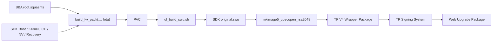
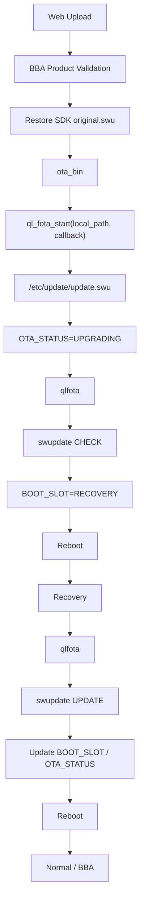

# M8280 / RG258UB_GLAB / UIS8510 / v610 升级机制与 BBA 3.3.0 接入设计

> 适用工程：M8280 / EU  
> Quectel Project：RG258UB_GLAB  
> Revision：RG258UB_GLABR01A01M4G  
> SoC：UIS8510  
> BSP：v610  
> Kernel：Linux 6.6  
> BBA：3.3.0  
> OTA 模型：Primary CHECK + Recovery UPDATE

---

## 目录

- [0. 文档范围与当前工程基线](#0-文档范围与当前工程基线)
  - [0.1 文档范围](#01-文档范围)
  - [0.2 当前工程基线](#02-当前工程基线)
  - [0.3 当前实现状态](#03-当前实现状态)
  - [0.4 证据分类与数据源优先级](#04-证据分类与数据源优先级)
  - [0.5 与其他专题文档的边界](#05-与其他专题文档的边界)
- [1. 系统整体架构](#1-系统整体架构)
  - [1.1 系统输入与最终结果](#11-系统输入与最终结果)
  - [1.2 构建侧阶段模型](#12-构建侧阶段模型)
  - [1.3 设备侧阶段模型](#13-设备侧阶段模型)
  - [1.4 阶段接口](#14-阶段接口)
- [2. 核心对象](#2-核心对象)
  - [2.1 SDK 原始 SWU](#21-sdk-原始-swu)
  - [2.2 TP 产品升级包](#22-tp-产品升级包)
  - [2.3 ql_fota_start API](#23-ql_fota_start-api)
  - [2.4 qlfota](#24-qlfota)
  - [2.5 swupdate](#25-swupdate)
  - [2.6 Recovery](#26-recovery)
  - [2.7 OTA 持久状态](#27-ota-持久状态)
- [3. SDK 升级包结构](#3-sdk-升级包结构)
  - [3.1 SWU 容器](#31-swu-容器)
  - [3.2 sw-description 与签名](#32-sw-description-与签名)
  - [3.3 当前 SWU 主要 payload](#33-当前-swu-主要-payload)
  - [3.4 updater override](#34-updater-override)
- [4. SDK SWU 构建链](#4-sdk-swu-构建链)
  - [4.1 BBA RootFS 输入](#41-bba-rootfs-输入)
  - [4.2 build_fw_pack fota 分支](#42-build_fw_pack-fota-分支)
  - [4.3 PAC 到 SWU](#43-pac-到-swu)
  - [4.4 SWU 输出目录](#44-swu-输出目录)
  - [4.5 当前构建侧边界](#45-当前构建侧边界)
- [5. TP 产品升级包构建](#5-tp-产品升级包构建)
  - [5.1 现有产品包机制](#51-现有产品包机制)
  - [5.2 mkimage5_quecopen_rsa2048](#52-mkimage5_quecopen_rsa2048)
  - [5.3 V4 Wrapper 布局](#53-v4-wrapper-布局)
  - [5.4 M8280 Build 接入位置](#54-m8280-build-接入位置)
- [6. BBA 设备侧升级入口](#6-bba-设备侧升级入口)
  - [6.1 Web / CMM / RSL 主链](#61-web--cmm--rsl-主链)
  - [6.2 升级文件生命周期](#62-升级文件生命周期)
  - [6.3 产品层处理](#63-产品层处理)
  - [6.4 SDK payload 恢复](#64-sdk-payload-恢复)
  - [6.5 ota_bin 适配边界](#65-ota_bin-适配边界)
- [7. ql_fota_start 与 Primary CHECK](#7-ql_fota_start-与-primary-check)
  - [7.1 API 调用](#71-api-调用)
  - [7.2 Local Path 与 canonical path](#72-local-path-与-canonical-path)
  - [7.3 FOTA 初始化](#73-fota-初始化)
  - [7.4 Primary SWUpdate CHECK](#74-primary-swupdate-check)
  - [7.5 callback 状态](#75-callback-状态)
  - [7.6 Recovery 切换](#76-recovery-切换)
- [8. Recovery UPDATE](#8-recovery-update)
  - [8.1 Recovery 启动条件](#81-recovery-启动条件)
  - [8.2 SWUpdate UPDATE](#82-swupdate-update)
  - [8.3 Flash 更新对象](#83-flash-更新对象)
  - [8.4 返回 Normal](#84-返回-normal)
- [9. 状态管理与异常保护](#9-状态管理与异常保护)
  - [9.1 BOOT_SLOT 与 OTA_STATUS](#91-boot_slot-与-ota_status)
  - [9.2 Recovery 升级过程掉电](#92-recovery-升级过程掉电)
  - [9.3 Primary 启动损坏](#93-primary-启动损坏)
  - [9.4 updater 缺失](#94-updater-缺失)
  - [9.5 OTA 日志](#95-ota-日志)
- [10. Runtime 文件与目录](#10-runtime-文件与目录)
  - [10.1 rootfs_data](#101-rootfs_data)
  - [10.2 /etc/update](#102-etcupdate)
  - [10.3 核心 Runtime 组件](#103-核心-runtime-组件)
- [11. BBA 3.3.0 M8280 接入设计](#11-bba-330-m8280-接入设计)
  - [11.1 接入原则](#111-接入原则)
  - [11.2 IMAGE_TAG ABI](#112-image_tag-abi)
  - [11.3 oal_sys_writeImage](#113-oal_sys_writeimage)
  - [11.4 ota_bin](#114-ota_bin)
  - [11.5 Web 文件与重启处理](#115-web-文件与重启处理)
  - [11.6 Build Package](#116-build-package)
  - [11.7 配置与宏边界](#117-配置与宏边界)
  - [11.8 最小修改文件](#118-最小修改文件)
- [12. 构建与验证路径](#12-构建与验证路径)
  - [12.1 首次接入构建](#121-首次接入构建)
  - [12.2 产物验证](#122-产物验证)
  - [12.3 设备侧验证](#123-设备侧验证)
- [13. 异常定位](#13-异常定位)
  - [13.1 SWU 未生成](#131-swu-未生成)
  - [13.2 TP 产品升级包未生成](#132-tp-产品升级包未生成)
  - [13.3 BBA 产品层校验失败](#133-bba-产品层校验失败)
  - [13.4 ql_fota_start 调用失败](#134-ql_fota_start-调用失败)
  - [13.5 QL_FOTA_LOCAL_VERIFY_ERROR](#135-ql_fota_local_verify_error)
  - [13.6 CHECK 成功但未进入 Recovery](#136-check-成功但未进入-recovery)
  - [13.7 Recovery UPDATE 异常](#137-recovery-update-异常)
- [14. 源码与产物索引](#14-源码与产物索引)
  - [14.1 BBA 产品层](#141-bba-产品层)
  - [14.2 SDK FOTA](#142-sdk-fota)
  - [14.3 SWU 构建](#143-swu-构建)
  - [14.4 TP Wrapper](#144-tp-wrapper)
  - [14.5 Runtime 产物](#145-runtime-产物)
- [15. 当前证据边界](#15-当前证据边界)
  - [15.1 已闭环事项](#151-已闭环事项)
  - [15.2 接入实施项](#152-接入实施项)
  - [15.3 保留 UNKNOWN](#153-保留-unknown)
- [16. 全链路索引](#16-全链路索引)

---

# 0. 文档范围与当前工程基线

## 0.1 文档范围

本文描述 M8280 / RG258UB_GLAB / UIS8510 / v610 的本地 OTA/FOTA 升级机制，以及该机制接入 BBA 3.3.0 产品升级框架的设计。

覆盖范围：

- BBA 最终 RootFS 与 SDK FOTA Build 的接口；
- SDK `.swu` 的组成、生成与输出；
- TP 产品层升级包的外层封装；
- BBA Web/CMM/RSL 本地升级入口；
- 产品层 payload 恢复；
- `ql_fota_start()` 调用边界；
- Primary `CHECK`；
- Recovery `UPDATE`；
- `BOOT_SLOT`、`OTA_STATUS` 与掉电续升；
- M8280 当前最小接入设计；
- 构建、运行和异常定位入口。

本文不重复展开：

- SDK 通用 Build System 全部阶段；
- PAC 内部全部下载 Item；
- QFlash、FDL1、FDL2、Repartition；
- Raw MTD / UBI 烧录实现；
- SecureBoot 签名内部算法；
- TP Signing System 内部实现。

这些内容分别由 Build System 与完整刷机指南维护。

## 0.2 当前工程基线

| 对象 | 当前值 |
|---|---|
| Product | `M8280 / EU` |
| Quectel Project | `RG258UB_GLAB` |
| Revision | `RG258UB_GLABR01A01M4G` |
| SoC | `UIS8510` |
| BSP | `v610` |
| Board | `1H10 + NAND` |
| Kernel | Linux 6.6 |
| Flash | 256 MiB SPI NAND |
| BBA | 3.3.0 |
| 正式工程根目录 | `/home/bba/work/bba/610/bba/3.3.0/bba_3_0_platform` |
| Platform | `platform/` |
| SDK | `sdk/ql_rg620ua/` |
| Model | `platform/build/model/M8280/EU/` |
| 最终 BBA Filesystem | `platform/targets/M8280/EU/filesystem/` |
| 最终 BBA Image | `platform/targets/M8280/EU/image/` |
| SDK Gold HEAD | `fc1b1da38c0b2ea9b327a3c8b7f744c2a96df4f0` |
| OTA 模型 | Recovery OTA |
| A/B OTA | 当前不使用 |

Quectel 已确认 v620 与 v610 使用相同的 Recovery OTA 总体机制。本文只记录 v610 当前工程的实际对象和路径。

## 0.3 当前实现状态

当前机制分为三个状态层级。

| 层级 | 状态 | 说明 |
|---|---|---|
| Quectel SDK 原生 FOTA | 已确认 | `.swu → ql_fota_start → qlfota → CHECK → Recovery → UPDATE` |
| BBA 通用产品升级框架 | 已存在 | Web、CMM/RSL、TAG、版本/产品校验、产品层处理链已有 |
| M8280 BBA 最终接入 | 设计冻结，待 Patch 落地 | 目标复用 M7400 框架，以 `.swu + ql_fota_start()` 替换最终厂商 backend |

本文在描述 SDK 原生流程时使用当前确认事实。

本文在描述 M8280 BBA 接入时明确标记“目标接入”或“接入设计”，不把尚未提交的 Patch 描述为当前 Runtime 事实。

## 0.4 证据分类与数据源优先级

本文使用以下证据等级：

| 标记 | 证据类型 | 可证明内容 |
|---|---|---|
| `SOURCE` | 当前源码 / Makefile / Shell / Header | 调用、构建、路径、接口、结构定义 |
| `BUILD` | Build 输出 / ELF / SWU / PAC | 实际生成对象、符号、文件组成 |
| `RUNTIME` | 样机日志 / 命令输出 / 挂载状态 | 当前样机实际执行行为 |
| `FAE` | Quectel 官方回复 | SDK 开放接口契约与 Recovery OTA 设计 |
| `TARGET` | 当前 M8280 接入设计 | 尚待 Patch 与编译/实机验证的产品适配 |
| `UNKNOWN` | 当前证据不足 | 不进入确定性主流程 |

数据冲突时采用：

```text
当前实际源码 / Runtime
    >
最新闭环记录 / FAE 明确回复
    >
当前 baseline
    >
历史增量记录
```

## 0.5 与其他专题文档的边界

《M8280 / RG258UB_GLAB / UIS8510 / v610 SDK Build System 与 BBA 3.3.0 接入机制》维护：

- `env_build`、`boot_build`、`kernel_build`、`modules_build`、`apps_build`、`fs_build`、`image_build`；
- SDK `build_dir`、`staging_dir`、`bin`；
- BBA Supplier Adapter；
- BBA RootFS 组装；
- PAC Build 前的整机物料汇聚。

本文只从以下接口接入：

```text
platform/targets/M8280/EU/image/root.squashfs
        ↓
build_fw_pack(..., fota)
```

《M8280 / RG258UB_GLAB / UIS8510 / v610 完整刷机指南》维护：

- PAC 内容；
- FDL1 / FDL2；
- Repartition；
- Raw MTD / UBI Volume 烧录；
- 下载完成后的启动。

本文只说明 PAC 在 `.swu` 生成链中的中间角色，不重复解释 PAC 下载协议。

---

# 1. 系统整体架构

## 1.1 系统输入与最终结果

M8280 本地升级包含构建侧与设备侧两条连续链。

构建侧输入：

```text
BBA 最终 root.squashfs
+
SDK Boot / Kernel / Modem / NV / Recovery 等整机物料
```

构建侧输出：

```text
SDK original.swu
    ↓
TP 产品层 Wrapper
    ↓
供 Web 本地升级使用的产品升级包
```

设备侧输入：

```text
TP 产品升级包
```

设备侧最终结果：

```text
Primary 固件由 Recovery 环境完成更新
    ↓
设备重新进入 Normal / BBA
```

## 1.2 构建侧阶段模型



阶段职责：

1. BBA `fs_build` 生成产品最终 RootFS。
2. SDK `build_fw_pack(..., fota)` 汇聚整机物料并生成 PAC。
3. `ql_build_swu.sh` 从目标 PAC 生成 SDK OTA payload。
4. `mkimage5_quecopen_rsa2048` 把 SDK `.swu` 作为产品升级 payload 放入现有 TP V4 Wrapper。
5. 既有 Signing System 继续处理产品升级包。

## 1.3 设备侧阶段模型



Primary 负责升级包检查和 Recovery 切换。

Recovery 负责正式 Flash 更新。

## 1.4 阶段接口

| 上一阶段 | 输出对象 | 下一阶段 Consumer |
|---|---|---|
| BBA RootFS Build | `root.squashfs` | `build_fw_pack()` |
| Firmware Packaging | PAC | `ql_build_swu.sh` |
| SWU Generator | `*.swu` | TP Wrapper Build |
| TP Wrapper Build | `*_UP_BOOT*.bin` 类产品包 | Signing System |
| Web Upload | 产品升级包文件 | BBA CMM/RSL |
| BBA 产品层处理 | SDK original `.swu` | `ota_bin` |
| `ota_bin` | Local SWU path | `ql_fota_start()` |
| FOTA Framework | `/etc/update/update.swu` | `qlfota` / `swupdate` |
| Primary CHECK | Recovery boot state | Bootloader / Recovery |
| Recovery UPDATE | 已更新 Primary Flash | Normal boot |

---

# 2. 核心对象

## 2.1 SDK 原始 SWU

对象：

```text
*.swu
```

类型：

```text
CPIO archive
```

Producer：

```text
ql_build_swu.sh
+
build_swu/swu_generator
```

输入：

```text
目标 PAC
+
sw-description template
+
签名/配置资源
```

Consumer：

```text
ql_fota_start()
→ qlfota
→ swupdate
```

当前目标输出目录：

```text
sdk/ql_rg620ua/bin/target/<REV>/update/
```

`.swu` 是 v610 SDK 原生 OTA payload。

## 2.2 TP 产品升级包

Producer：

```text
mkimage5_quecopen_rsa2048
+
现有 TP Signing System
```

内部 payload：

```text
SDK original.swu
```

Consumer：

```text
BBA Web / CMM / RSL 本地升级框架
```

该对象只承担产品层封装。

设备端产品层处理结束后，传入 SDK FOTA 的对象仍为原始 `.swu`。

## 2.3 ql_fota_start API

接口：

```c
typedef void (*fota_cb)(QL_ERR_E cb_ret);
QL_ERR_E ql_fota_start(const char *path, fota_cb cb_ret);
```

Provider：

```text
libqlril.so
```

Header：

```text
ql_fota.h
```

输入：

```text
Local SWU path
+
callback
```

职责：

- 接收本地 SWU；
- 准备 SDK FOTA canonical path；
- 设置 OTA 升级状态；
- 启动后续 FOTA 流程。

应用层只依赖公开 FOTA API。

`quec_upgrade_swupdate()` 等内部接口不作为 BBA 接入接口。

## 2.4 qlfota

Runtime：

```text
/usr/bin/qlfota
```

职责：

- OTA 状态检查；
- Primary `CHECK` 调度；
- Recovery `UPDATE` 调度；
- `BOOT_SLOT` / `OTA_STATUS` 更新；
- Recovery 与 Normal 间的切换控制。

SDK 支持 updater override：

```text
/etc/update/qlfota
```

不存在时使用：

```text
/usr/bin/qlfota
```

## 2.5 swupdate

Runtime：

```text
/usr/bin/swupdate
```

职责：

- 解析 `sw-description`；
- 验证 SWU；
- Primary 阶段执行 CHECK；
- Recovery 阶段执行 UPDATE；
- 根据 handler 执行实际镜像安装和 Flash 更新。

SDK 支持：

```text
/etc/update/swupdate
```

不存在时使用：

```text
/usr/bin/swupdate
```

## 2.6 Recovery

Recovery 是独立于 Primary 的 OTA 执行环境。

职责：

```text
读取升级状态
    ↓
运行 qlfota
    ↓
调用 swupdate UPDATE
    ↓
更新 Primary Flash
```

当前 OTA 不升级 Recovery 自身。

Recovery 不承担 WAN、ACS 等完整业务功能。

## 2.7 OTA 持久状态

已确认状态对象包括：

```text
BOOT_SLOT
OTA_STATUS
```

SDK OTA 相关代码和记录中还存在：

```text
OTA_COUNT
OTA_REBOOT
```

本文不扩展未确认字段的具体算法。

主流程只依赖已确认行为：

```text
ql_fota_start
    ↓
OTA_STATUS=UPGRADING

CHECK PASS
    ↓
BOOT_SLOT=RECOVERY

UPDATE END
    ↓
BOOT_SLOT / OTA_STATUS 更新
```

---

# 3. SDK 升级包结构

## 3.1 SWU 容器

当前 `.swu` 是 CPIO archive。

主要逻辑对象：

```text
sw-description
sw-description.sig
firmware payloads
whitelist.cfg
shellscript.sh
```

SWU 是 SDK OTA 的完整安装输入，不是 PAC 的简单改名。

## 3.2 sw-description 与签名

`sw-description` 定义：

- hardware compatibility；
- software set / mode；
- payload；
- handler；
- 目标分区或目标安装对象；
- 安装顺序；
- shell hook。

模板路径：

```text
sdk/ql_rg620ua/quectel/services/swupdate/build_swu/project/sprd/
uis8510-1h10-nand-cpe/sw-description.conf
```

签名文件：

```text
sw-description.sig
```

生成侧由 SWU Generator 使用 SDK 配套签名流程产生。

Runtime 校验由 `swupdate` 完成。

## 3.3 当前 SWU 主要 payload

当前 RG258UB_GLAB 普通 SWU 已观察到的主要对象包括：

```text
sml-sign.bin.zst
tos-sign.bin.zst
teecfg-sign.bin.zst
u-boot-sign.bin.zst
boot-sign.img.zst
root-sign.squashfs.zst
deltanv-sign.bin.zst

SC9600_QogirN5_PS_V610_CPE_LIC_modem-sign.bin.zst
SC9600_QogirN5_PHY_V610_CPE_modem-sign.bin.zst
ums9632_v610_adsp-sign.bin.zst
UIS8510_SP-sign.bin.zst

nvitem.bin.zst
sysdump-sign.bin.zst

whitelist.cfg
shellscript.sh
```

具体安装目标以当前 `sw-description.conf` 为准。

完整 Flash Partition / UBI Volume 映射由刷机指南维护。

## 3.4 updater override

`ql_fota_start_local()` 会在 `/etc/update` 中尝试执行：

```text
cpio -idv < /etc/update/update.swu swupdate qlfota
```

该步骤的 Consumer 是 SWU 内可选的：

```text
qlfota
swupdate
```

SWU 包含 updater 时：

```text
/etc/update/qlfota
/etc/update/swupdate
```

可覆盖固化版本。

SWU 不包含 updater 时：

```text
/usr/bin/qlfota
/usr/bin/swupdate
```

继续作为 fallback。

当前普通 RG258UB_GLAB SWU 不依赖必须携带 updater。

---

# 4. SDK SWU 构建链

## 4.1 BBA RootFS 输入

BBA 3.3.0 最终用户态文件系统生成于：

```text
platform/targets/M8280/EU/filesystem/
```

随后形成：

```text
platform/targets/M8280/EU/image/root.squashfs
```

OTA 构建不使用 SDK Native RootFS 替代该对象。

接口：

```text
BBA root.squashfs
    ↓
build_fw_pack(external_rootfs, fota)
```

BBA RootFS 的详细 Producer 链由 Build System 专项文档维护。

## 4.2 build_fw_pack fota 分支

BBA Supplier Adapter：

```text
platform/build/makes/Makefile.sdk.quecopen_rg620ua.mk
```

image 阶段调用 SDK：

```text
build_fw_pack <BBA root.squashfs> fota
```

该阶段先完成整机 Firmware Packaging。

主要汇聚目录：

```text
sdk/ql_rg620ua/bin/unisoc/temp/
```

输入包括：

```text
BBA root.squashfs
Boot
Kernel / boot.img
Recovery
AP Secure Firmware
CP / Modem Firmware
NV / Product resources
Partition metadata
```

## 4.3 PAC 到 SWU

`fota` 参数使 PAC 生成完成后继续进入 SWU 生成分支。

`ql_build_config` 中的逻辑接口为：

```text
TARGET_FIRMWARE=<release/update/*.pac>
    ↓
quectel/services/swupdate/build_swu/ql_build_swu.sh
    ↓
*.swu
```

因此 PAC 在 OTA Build 中承担：

```text
整机 signed firmware 汇聚结果
    ↓
SWU Generator 输入
```

PAC 的下载协议和 Flash Item 不是本章范围。

## 4.4 SWU 输出目录

目标 Release 目录：

```text
sdk/ql_rg620ua/bin/target/
RG258UB_GLABR01A01M4G/update/
```

该目录应同时观察：

```text
*.pac
*.swu
```

SWU 是后续 TP 产品包装阶段的输入。

## 4.5 当前构建侧边界

当前 `Makefile.sdk.quecopen_rg620ua.mk` 已有：

```text
build_fw_pack(..., fota)
```

当前 BBA `mkupgrade_build` 仍需接入 `.swu → IMAGE_TOOL` 产品包装逻辑。

历史/增量记录中曾出现 SWU Generator 对 BBA RootFS 中：

```text
/etc/config/projectinfo
```

路径预期与 BBA `config_bak`/runtime symlink 机制不一致的问题。

该项属于当前 Build 接入验证对象。

文档不把未确认已修复的历史报错描述为当前永久机制。

---

# 5. TP 产品升级包构建

## 5.1 现有产品包机制

BBA 现有 QuecOpen 产品升级包采用：

```text
SDK vendor OTA payload
    ↓
mkimage5_quecopen_rsa2048
    ↓
TP V4 Wrapper
    ↓
Signing System
```

参考平台包括 M7400、M7750、M8550。

这些平台只作为产品层包装方式的实现参考。

其 modem/LTE 升级 backend 不进入 M8280 Runtime 主流程。

M8280 的 SDK payload 为：

```text
original.swu
```

## 5.2 mkimage5_quecopen_rsa2048

Host Tool：

```text
mkimage5_quecopen_rsa2048
```

源码：

```text
src5_quecopen/mkimage.c
src5_quecopen/mkimage.h
src5_quecopen/Makefile
```

RSA2048 variant 由：

```text
-DTAG_RSA2048
```

构建。

`-f` 输入文件按原始文件内容读取并追加到产品 TAG 后。

Tool 不解析 `.swu` 内部格式。

M8280 可以使用：

```text
-f <SDK original.swu>
```

作为输入。

现有调用形态：

```make
$(IMAGE_TOOL) \
    -f <SDK original.swu> \
    -p $(IMG_TG_PATH)/reduced_data_model.xml \
    -i $(IMG_TG_PATH)
```

`INCLUDE_IMAGE_NEW_TAG=y` 时现有 Supplier Makefile 选择：

```text
mkimage5_quecopen_rsa2048
```

## 5.3 V4 Wrapper 布局

当前 RSA2048 V4 中间包静态布局：

```text
offset 0x000
├─ IMAGE_TAG                    0x200 / 512 bytes
│
offset 0x200
├─ IMAGE_SUBTAG_SG_CLS          0x128 / 296 bytes
│   ├─ type
│   ├─ subtagLength
│   ├─ rsa256[256]
│   └─ iv[32]
│
offset 0x328
├─ IMAGE_SUBTAG_END             0x008 / 8 bytes
│
offset 0x330
└─ SDK original.swu
```

典型静态 Wrapper 长度：

```text
0x330
```

设备端不应把 `0x330` 作为固定协议常量使用。

当前公共 parser：

```text
util_getTagLen()
```

用于按实际 SUB_TAG 链得到 payload offset。

## 5.4 M8280 Build 接入位置

当前：

```text
image_build
    ↓
quecopen_image_build
    ├─ mkburning_build
    └─ mkupgrade_build
```

`mkburning_build` 通过：

```text
build_fw_pack(..., fota)
```

生成 SDK `.swu`。

`mkupgrade_build` 当前为空。

M8280 目标：

```text
mkburning_build
    ↓
SDK original.swu
    ↓
mkupgrade_build
    ↓
mkimage5_quecopen_rsa2048
    ↓
TP Wrapper Package
```

Build 接入必须保持 Producer / Consumer 顺序：

```text
original.swu 已存在
    ↓
IMAGE_TOOL 才执行
```

不新增第二套 `build_fw_pack()`。

---

# 6. BBA 设备侧升级入口

## 6.1 Web / CMM / RSL 主链

当前 BBA 本地 Web 升级主链：

```text
POST /cgi/softup
    ↓
http_rpm_update()
    ↓
http_rpm_softburn()
    ↓
rdp_updateFirmware()
    ↓
rsl_sys_updateFirmware()
    ↓
oal_sys_writeImage()
```

职责划分：

| 层级 | 职责 |
|---|---|
| Web | 上传升级文件、触发升级 |
| RDP | 产品业务接口转发 |
| RSL | 产品层升级校验与策略 |
| OAL | 最终平台 backend |
| `ota_bin` | QuecOpen SDK FOTA API adapter |

M8280 不新增第二套 Web OTA 接口。

## 6.2 升级文件生命周期

Web 下载路径可由产品配置选择。

M8280 目标路径放在持久分区：

```text
/rootfs_data/http_upgrade.bin
```

上传完成时文件内容：

```text
TP Product Wrapper
+
SDK original.swu
```

产品层处理结束后，同一文件恢复为：

```text
SDK original.swu
```

后续 `ql_fota_start()` 使用该 Local Path。

`rootfs_data` 的持久性使 SWU 能跨越：

```text
Primary
    ↓ reboot
Recovery
```

继续被 FOTA Framework 使用。

## 6.3 产品层处理

M8280 复用当前 BBA 产品升级公共处理。

当前已选配置包括：

```text
INCLUDE_IMAGE_NEW_TAG
INCLUDE_FWUPGRADE_CHECK
INCLUDE_FWUPGRADE_CHECK_MD5
INCLUDE_FWUPGRADE_CHECK_RSA
INCLUDE_FWUPGRADE_CHECK_PRODUCT_ID
INCLUDE_FWUPGRADE_CHECK_ADDHWVER
INCLUDE_FWUPGRADE_CHECK_SPECIAL_VER
```

这些配置证明相应产品层检查逻辑被选择。

实际 Runtime 仍以当前 RSL/OAL 源码调用路径为准。

M8280 不接入：

```text
INCLUDE_SINGLE_LTEIMAGE
ASR/SDX LTE block split
QFirehose
独立 modem update.zip flow
```

## 6.4 SDK payload 恢复

BBA 完成产品层处理后，M8280 的 OAL backend 需要从产品包恢复 original SWU。

参考 M7400 已有文件原地搬移实现：

```text
open
    ↓
pread
    ↓
pwrite
    ↓
ftruncate
    ↓
fsync
```

M8280 payload offset：

```text
tagLen = util_getTagLen(pAddr, length)
```

恢复关系：

```text
/rootfs_data/http_upgrade.bin

Before:
[TP TAG][SUB TAG chain][original.swu]

After:
[original.swu]
```

目标验收：

```text
SHA256(stripped payload)
==
SHA256(SDK original.swu)
```

该 SHA256 比较用于确认产品层剥离结果，不改变现有升级协议。

## 6.5 ota_bin 适配边界

M7400 当前使用：

```text
oal_sys_writeImage()
    ↓
fork / exec
    ↓
/usr/bin/ota_bin
    ↓
ASR FOTA API
```

M8280 目标保留该边界：

```text
oal_sys_writeImage()
    ↓
fork / exec
    ↓
/usr/bin/ota_bin
    ↓
ql_fota_start(local_swu, callback)
```

平台差异收敛在 `ota_bin`。

`libcmm.so` 不需要直接依赖 `libqlril.so`。

---

# 7. ql_fota_start 与 Primary CHECK

## 7.1 API 调用

M8280 上层调用：

```c
ql_fota_start(local_swu_path, callback);
```

SDK sample：

```text
ql_fota_test.c
```

对 immediate return 的处理表明：

```text
QL_FOTA_SUCCESS
或
QL_FOTA_CALLBACK
    ↓
FOTA task 启动
    ↓
后续状态通过 callback 返回
```

Immediate return 不表示 Recovery Flash 已完成。

## 7.2 Local Path 与 canonical path

Quectel FAE 已确认：

```text
ql_fota_start()
```

传入的本地 SWU 路径没有固定目录限制。

例如：

```text
/rootfs_data/http_upgrade.bin
```

属于有效 Local Path。

FOTA Framework 内部创建：

```text
/etc/update/update.swu
```

软链接。

对象关系：

```text
Caller Local Path
    ↓
ql_fota_start()
    ↓
/etc/update/update.swu -> Caller Local Path
```

调用方不需要预先把 SWU 自行复制到 `/etc/update/update.swu`。

## 7.3 FOTA 初始化

Quectel 已确认 Local FOTA 主流程：

```text
ql_fota_start(local_swu)
    ↓
创建 /etc/update/update.swu
    ↓
OTA_STATUS=UPGRADING
    ↓
尝试提取 updater
    ↓
运行 qlfota
```

`/etc/` 在 Quectel SDK 设计中使用 overlay 提供可写语义。

M8280 BBA Runtime 必须保证 FOTA 所需的 `/etc/update` 写入语义成立。

具体 overlay 实现由当前产品 RootFS/启动脚本决定。

## 7.4 Primary SWUpdate CHECK

Primary 中：

```text
qlfota
    ↓
quec_ota_status_check()
    ↓
quec_upgrade_swupdate("CHECK")
    ↓
swupdate -c
```

当前实机曾捕获：

```text
/usr/bin/swupdate \
    -f /etc/update/swupdate.cfg \
    -c \
    -i /etc/update/update.swu \
    -e board,NORMAL_UPDATE
```

其中：

```text
-c
```

表示 Dry Run / CHECK。

CHECK 阶段承担：

- `sw-description.sig` 检查；
- hardware compatibility；
- `sw-description` 解析；
- payload 可用性检查；
- 安装前条件检查。

Primary CHECK 不执行正式 Flash 更新。

## 7.5 callback 状态

SDK sample 对 Local FOTA 的主要 callback：

```text
QL_FOTA_LOCAL_SUCCESS
    =
Local upgrade check file success

QL_FOTA_LOCAL_VERIFY_ERROR
    =
Local upgrade check file failed
```

`QL_FOTA_LOCAL_SUCCESS` 表示 Local SWU CHECK 成功。

它不是 Recovery UPDATE 已完成的状态。

M8280 `ota_bin` 对 callback 的具体等待/退出策略属于产品 adapter 实施细节，见第 15 章证据边界。

## 7.6 Recovery 切换

FAE 已确认：

```text
Primary CHECK PASS
    ↓
设置 BOOT_SLOT
    ↓
reboot
    ↓
进入 Recovery
```

BBA Web 层不承担该 Recovery reboot。

SDK FOTA Framework 接管后续 boot slot 与 reboot。

---

# 8. Recovery UPDATE

## 8.1 Recovery 启动条件

Primary CHECK 成功后：

```text
BOOT_SLOT=RECOVERY
```

持久状态写入完成。

设备 reboot。

Bootloader 根据当前状态进入 Recovery。

## 8.2 SWUpdate UPDATE

Recovery 中：

```text
qlfota
    ↓
quec_upgrade_swupdate("UPDATE")
    ↓
swupdate
```

该阶段执行正式安装。

职责：

```text
读取 /etc/update/update.swu
    ↓
解析 sw-description
    ↓
执行对应 handler
    ↓
擦除/写入 Primary 对象
```

应用层无需直接调用 `quec_upgrade_swupdate()`。

## 8.3 Flash 更新对象

具体更新对象由：

```text
sdk/ql_rg620ua/quectel/services/swupdate/build_swu/project/sprd/
uis8510-1h10-nand-cpe/sw-description.conf
```

决定。

SWU 中的 signed/compressed payload 与 `sw-description` 共同定义实际更新内容。

本文不从“SWU 中存在某 payload”自动推导其 Flash target。

Flash target 以当前 `sw-description` handler 配置为准。

完整 MTD / UBI 布局见刷机指南。

## 8.4 返回 Normal

FAE 已确认 UPDATE 结束后：

```text
修改 BOOT_SLOT
修改 OTA_STATUS
    ↓
reboot
    ↓
Normal
```

成功和失败均由 SDK OTA 状态机处理相应状态后返回 Normal 或按升级状态继续 Recovery 流程。

上层产品代码不直接修改 SDK 内部 boot slot 状态。

---

# 9. 状态管理与异常保护

## 9.1 BOOT_SLOT 与 OTA_STATUS

Primary：

```text
ql_fota_start()
    ↓
OTA_STATUS=UPGRADING
```

CHECK 成功：

```text
BOOT_SLOT=RECOVERY
```

Recovery UPDATE 结束：

```text
BOOT_SLOT / OTA_STATUS 更新
```

这些状态需要跨 reboot 保存。

SDK 使用持久状态区和对应工具维护 OTA 状态。

## 9.2 Recovery 升级过程掉电

Quectel 已确认：

```text
Recovery UPDATE
    ↓
掉电
    ↓
重新上电
    ↓
检测 OTA 标志
    ↓
继续进入 Recovery
    ↓
继续执行升级
```

该能力成立的关键结构条件：

```text
OTA 不升级 Recovery 分区
```

当前 Recovery 自身不会被本次 OTA payload 覆盖。

因此升级过程中掉电不会因为 Recovery 自身被写到一半而失去 OTA 执行环境。

## 9.3 Primary 启动损坏

当前机制不提供：

```text
Primary boot image crash
    ↓
自动切换 Recovery
    ↓
自动修复
```

Quectel 已明确该场景不属于当前 Recovery OTA 的自动恢复能力。

Recovery OTA 的异常保护边界集中在 OTA 升级过程。

## 9.4 updater 缺失

Local FOTA 会尝试从 SWU 中提取：

```text
qlfota
swupdate
```

SWU 不包含时：

```text
/usr/bin/qlfota
/usr/bin/swupdate
```

继续作为 fallback。

因此“SWU 不包含 updater”不是默认升级失败条件。

如果产品后续使用携带 updater 的 `--fw` SWU，则 Runtime 必须保证 `cpio` 提取能力可用。

## 9.5 OTA 日志

Quectel 已确认 Normal 与 Recovery 使用一致的 OTA 日志路径策略。

执行：

```text
AT+QTEST="debug",1
```

后，调试日志可保存到：

```text
/log/
```

异常定位时应同时检查：

```text
qlfota
swupdate
BOOT_SLOT
OTA_STATUS
/log/
```

---

# 10. Runtime 文件与目录

## 10.1 rootfs_data

角色：

```text
产品侧持久升级文件存储
```

M8280 目标：

```text
/rootfs_data/http_upgrade.bin
```

阶段变化：

```text
Web Upload 完成：
TP Wrapper + original.swu

BBA 产品层恢复完成：
original.swu

Primary → Recovery：
文件持续存在
```

Producer：

```text
Web upload
```

Consumer：

```text
BBA upgrade backend
ql_fota_start()
/etc/update/update.swu symlink
Recovery FOTA flow
```

## 10.2 /etc/update

SDK FOTA canonical runtime 目录：

```text
/etc/update/update.swu
/etc/update/qlfota
/etc/update/swupdate
/etc/update/swupdate.cfg
/etc/update/hwrevision
/etc/update/key/
```

对象职责：

| 对象 | 职责 |
|---|---|
| `update.swu` | Local SWU canonical path |
| `qlfota` | 可选 updater override |
| `swupdate` | 可选 updater override |
| `swupdate.cfg` | SWUpdate runtime 配置 |
| `hwrevision` | hardware compatibility 输入 |
| `key/public.pem` | SDK OTA 验证资源 |
| `key/aes_key_IV` | SDK OTA 相关运行资源 |

实际最终 RootFS 是否包含上述文件，应以：

```text
platform/targets/M8280/EU/filesystem/
```

和板端 Runtime 为最终验证点。

## 10.3 核心 Runtime 组件

| 组件 | 典型路径 | Owner | Consumer |
|---|---|---|---|
| `libqlril.so` | `/usr/lib/libqlril.so` | Quectel SDK | `ota_bin` |
| `qlfota` | `/usr/bin/qlfota` | Quectel SDK | FOTA Framework |
| `swupdate` | `/usr/bin/swupdate` | Quectel SDK | `qlfota` |
| `rawdata-tool` | `/usr/bin/rawdata-tool` | Quectel SDK | OTA 状态维护 |
| `whitelist_check.sh` | `/usr/bin/whitelist_check.sh` | Quectel SDK | OTA 检查 |
| `ota_bin` | `/usr/bin/ota_bin` | BBA | `oal_sys_writeImage()` |
| Product SWU | `/rootfs_data/...` | BBA Web | `ql_fota_start()` |

---

# 11. BBA 3.3.0 M8280 接入设计

本章描述 TARGET 状态。

当前目标是复用已有 BBA/M7400 产品升级框架，只替换 M8280 的 SDK FOTA backend。

## 11.1 接入原则

保持：

```text
Web
→ RDP
→ RSL
→ OAL
→ ota_bin
```

保持已有：

```text
TP TAG
MD5
RSA
PRODUCT_ID
ADDHWVER
SPECIAL_VER
```

平台差异收敛在：

```text
payload strip
+
ota_bin FOTA API
+
Web 文件生命周期
+
Build payload 类型
```

不接入 ASR/SDX 的独立 LTE image 分块机制。

## 11.2 IMAGE_TAG ABI

当前 M8280：

```text
INCLUDE_ARM64=y
```

`oal_partition.h` 默认 `unsigned long` 版 `IMAGE_TAG` 在 aarch64 LP64 ABI 下按字段布局为：

```text
672 bytes
```

现有产品协议：

```text
TP_TAG_LEN = 512
```

M8280 目标加入已有 fixed-width 64-bit `IMAGE_TAG` 分支：

```text
defined(INCLUDE_SPEC_M8280)
```

复用已有：

```text
unsigned int
unsigned long long
```

布局。

目标：

```text
sizeof(IMAGE_TAG) == 512
```

不新增新的 TAG format。

实施时应由目标 aarch64 编译环境完成最终 `sizeof(IMAGE_TAG)` 验证。

## 11.3 oal_sys_writeImage

现有 M7400 backend 已包含：

```text
strip wrapper
    ↓
fork
    ↓
exec ota_bin
    ↓
waitpid
```

M8280 复用该框架。

M7400 原有 fixed skip 行为保持不变。

M8280：

```text
util_getTagLen(pAddr, length)
    ↓
得到实际 Wrapper 长度
    ↓
pread/pwrite
    ↓
ftruncate
    ↓
fsync
    ↓
original.swu
```

M8280 不使用：

```text
ota_bin ASR 写包 API
SINGLE_LTEIMAGE
LTE block read/write
QFirehose
```

## 11.4 ota_bin

`ota_bin` 继续作为 BBA 与 Quectel SDK 的 Adapter。

目标编译分支：

```text
M7400 / ASR1828
    ↓
保持当前 ql_fota_init / fw_write / done 路径

M8280 / RG620UA / UIS8510
    ↓
ql_fota_start(path, callback)
```

M8280 依赖：

```text
ql_fota.h
libqlril.so
```

该依赖只进入 `ota_bin`。

`libcmm.so` 不直接链接 `libqlril.so`。

SDK sample 已确认：

```text
QL_FOTA_SUCCESS
QL_FOTA_CALLBACK
```

均属于启动任务后的正常 immediate return 类型。

`ota_bin` 的最终退出时机见第 15.3 节。

## 11.5 Web 文件与重启处理

M8280 Web 下载路径选择持久存储：

```text
/rootfs_data/http_upgrade.bin
```

路径选择使用现有产品宏/配置机制，不新增另一套下载框架。

FOTA backend 接管成功后，Web 层目标行为：

```text
释放上传 mmap
保留 SWU 文件
不 unlink
不执行传统 ACT_REBOOT
不进入传统永久 while
```

原因：

```text
ql_fota_start()
    ↓
Primary CHECK
    ↓
SDK 设置 BOOT_SLOT
    ↓
SDK reboot
```

Web 不拥有 Recovery reboot。

## 11.6 Build Package

当前：

```text
Makefile.sdk.quecopen_rg620ua.mk
```

已调用：

```text
build_fw_pack(..., fota)
```

并能进入 SDK SWU Generator。

目标在 SWU 生成之后执行：

```make
$(IMAGE_TOOL) \
    -f <SDK original.swu> \
    -p $(IMG_TG_PATH)/reduced_data_model.xml \
    -i $(IMG_TG_PATH)
```

当前：

```text
INCLUDE_IMAGE_NEW_TAG=y
```

选择：

```text
mkimage5_quecopen_rsa2048
```

输入：

```text
SDK original.swu
```

输出：

```text
*_UP_BOOT*.bin
```

后续继续使用既有 TP Signing System。

## 11.7 配置与宏边界

当前 M8280 已有：

```text
INCLUDE_IMAGE_NEW_TAG=y
INCLUDE_ISP_RSA2048=y
INCLUDE_FWUPGRADE_CHECK=y
INCLUDE_FWUPGRADE_CHECK_MD5=y
INCLUDE_FWUPGRADE_CHECK_RSA=y
INCLUDE_FWUPGRADE_CHECK_PRODUCT_ID=y
INCLUDE_FWUPGRADE_CHECK_ADDHWVER=y
INCLUDE_FWUPGRADE_CHECK_SPECIAL_VER=y
INCLUDE_MTD_TYPE_FS=y
INCLUDE_LTEWAN=y
INCLUDE_QUECOPEN_RG620UA=y
```

M8280 接入不应启用：

```text
INCLUDE_SINGLE_LTEIMAGE
INCLUDE_QUECOPEN_ASR1828
INCLUDE_QUECOPEN_SDX6X
INCLUDE_QUECOPEN_SDX7X
INCLUDE_QUECOPEN_SDX12
```

机型差异优先使用：

```text
INCLUDE_SPEC_M8280
+
INCLUDE_QUECOPEN_RG620UA
```

限定。

是否新增独立功能宏由最终 Patch 风格决定，不作为 SDK OTA 机制前提。

## 11.8 最小修改文件

当前目标修改范围：

| 文件 | 目标职责 |
|---|---|
| `oal_partition.h` | M8280 进入已有 512-byte ARM64 TAG ABI |
| `oal_sys.c` | M8280 复用 wrapper strip + `ota_bin` backend |
| `ota_bin/ota_bin.c` | M8280 使用 `ql_fota_start()` |
| `ota_bin/Makefile` | M8280 Header / `libqlril` 依赖 |
| `platform/apps/private/user/Makefile` | M8280 构建/安装 `ota_bin` |
| Web softup 源码 | M8280 持久下载路径与 FOTA 成功后的文件/reboot 处理 |
| `Makefile.sdk.quecopen_rg620ua.mk` | original SWU → IMAGE_TOOL |
| `config.bba` | 仅在最终 Patch 确有新增开关时修改 |

其他机型现有升级行为保持不变。

---

# 12. 构建与验证路径

## 12.1 首次接入构建

BBA 全阶段典型入口：

```bash
cd /home/bba/work/bba/610/bba/3.3.0/bba_3_0_platform/platform/build

make SHELL=/bin/bash \
    MODEL=M8280 \
    SPEC=EU \
    env_build \
    boot_build \
    kernel_build \
    modules_build \
    apps_build \
    fs_build \
    image_build
```

升级适配修改集中在：

```text
apps
fs
image
```

但首次接入建议执行完整阶段构建，避免旧 `ota_bin`、旧 RootFS 或旧 image packaging 缓存干扰。

## 12.2 产物验证

构建侧按阶段验证：

```text
1. BBA RootFS
platform/targets/M8280/EU/image/root.squashfs

2. SDK PAC
sdk/ql_rg620ua/bin/target/<REV>/update/*.pac

3. SDK original SWU
sdk/ql_rg620ua/bin/target/<REV>/update/*.swu

4. TP Wrapper package
platform/targets/M8280/EU/image/*_UP_BOOT*.bin
或 IMAGE_TOOL 实际输出路径
```

SWU 与 Wrapper payload 验收：

```text
SDK original.swu
    ↓ SHA256

TP Wrapper strip 后 payload
    ↓ SHA256

两者一致
```

## 12.3 设备侧验证

设备侧主路径验收：

```text
Web upload
    ↓
产品层校验通过
    ↓
strip 后 SWU 可被识别
    ↓
ql_fota_start immediate return 正常
    ↓
/etc/update/update.swu 建立
    ↓
Primary CHECK PASS
    ↓
QL_FOTA_LOCAL_SUCCESS
    ↓
自动进入 Recovery
    ↓
Recovery UPDATE
    ↓
自动返回 Normal
```

关键观察对象：

```text
/rootfs_data/http_upgrade.bin
/etc/update/update.swu
qlfota
swupdate
BOOT_SLOT
OTA_STATUS
/log/
```

---

# 13. 异常定位

## 13.1 SWU 未生成

所属阶段：

```text
SDK SWU Build
```

首查：

```text
build_fw_pack(..., fota)
```

输出目录：

```text
sdk/ql_rg620ua/bin/target/<REV>/update/
```

源码入口：

```text
sdk/ql_rg620ua/quectel/unisoc/compile/ql_build_config
sdk/ql_rg620ua/quectel/services/swupdate/build_swu/ql_build_swu.sh
```

继续检查：

```text
PAC 是否已生成
SWU Generator 是否执行
projectinfo 是否满足 preprocessor 输入
```

## 13.2 TP 产品升级包未生成

所属阶段：

```text
BBA Product Packaging
```

首查：

```text
SDK original.swu
    ↓
mkupgrade_build
    ↓
IMAGE_TOOL
```

关键对象：

```text
Makefile.sdk.quecopen_rg620ua.mk
mkimage5_quecopen_rsa2048
IMG_TG_PATH
reduced_data_model.xml
```

## 13.3 BBA 产品层校验失败

所属阶段：

```text
RSL Product Validation
```

首查：

```text
IMAGE_TAG layout
TAG/SUB_TAG parser
MD5
PRODUCT_ID
ADDHWVER
SPECIAL_VER
RSA return
```

M8280 重点确认：

```text
IMAGE_TAG == 512 bytes
```

## 13.4 ql_fota_start 调用失败

所属阶段：

```text
BBA → SDK FOTA API
```

首查：

```text
Local SWU path
文件权限
/rootfs_data 挂载
/etc/update 写入能力
libqlril
ql_fota_start immediate return
```

确认：

```text
/etc/update/update.swu
```

是否已创建并正确指向 Local Path。

## 13.5 QL_FOTA_LOCAL_VERIFY_ERROR

所属阶段：

```text
Primary SWUpdate CHECK
```

典型 callback：

```text
QL_FOTA_LOCAL_VERIFY_ERROR
```

首查：

```text
sw-description.sig
hardware compatibility
sw-description
public.pem
swupdate.cfg
TMPDIR
临时文件系统可用空间
```

历史实机已闭环过一个具体失败：

```text
SWUpdate:
Not enough free space to extract ...
got 0
```

当时根因是：

```text
TMPDIR=/var/tmp
statvfs() 返回可用空间 0
```

该历史问题用于异常定位，不代表当前所有 `LOCAL_VERIFY_ERROR` 都由 TMPDIR 导致。

## 13.6 CHECK 成功但未进入 Recovery

所属阶段：

```text
qlfota state transition
```

首查：

```text
QL_FOTA_LOCAL_SUCCESS
BOOT_SLOT
OTA_STATUS
qlfota process
/log/
```

正常接口：

```text
CHECK PASS
    ↓
BOOT_SLOT=RECOVERY
    ↓
SDK reboot
```

## 13.7 Recovery UPDATE 异常

所属阶段：

```text
Recovery FOTA
```

首查：

```text
BOOT_SLOT
OTA_STATUS
Recovery qlfota
Recovery swupdate
/log/
```

升级中断电后应优先确认设备是否仍按 OTA 状态重新进入 Recovery。

---

# 14. 源码与产物索引

## 14.1 BBA 产品层

| 功能 | 路径 / 对象 |
|---|---|
| M8280 Model | `platform/build/model/M8280/EU/` |
| Supplier Adapter | `platform/build/makes/Makefile.sdk.quecopen_rg620ua.mk` |
| Private User Apps | `platform/apps/private/user/Makefile` |
| CMM Library | `platform/apps/private/user/clibs/cmm_lib/` |
| `oal_sys_writeImage()` | `platform/apps/private/user/clibs/cmm_lib/osAbstr/linux/src/oal_sys.c` |
| `IMAGE_TAG` | `platform/apps/private/user/clibs/cmm_lib/include/oal_partition.h` |
| SDK FOTA Adapter | `platform/apps/private/user/ota_bin/` |
| Web Upgrade | `http_rpm_softup.c` 所在 Web RPM 目录 |
| RSL Upgrade | `rsl_sys.c` |

## 14.2 SDK FOTA

| 功能 | 路径 / 对象 |
|---|---|
| FOTA API Header | `sdk/ql_rg620ua/quectel/hal/ril/libqlril/src/inc/ql_fota.h` |
| API Sample | `sdk/ql_rg620ua/quectel/opendev/sample/src/ql_fota_test.c` |
| API Provider | `sdk/ql_rg620ua/staging_dir/target-aarch64_cortex-a55_musl/usr/lib/libqlril.so` |
| qlfota Package | `sdk/ql_rg620ua/quectel/services/qlfota/` |
| qlfota init | `sdk/ql_rg620ua/quectel/services/qlfota/files/qlfota.init` |
| SWUpdate Package | `sdk/ql_rg620ua/quectel/services/swupdate/` |

## 14.3 SWU 构建

| 功能 | 路径 |
|---|---|
| SWU Entry | `sdk/ql_rg620ua/quectel/services/swupdate/build_swu/ql_build_swu.sh` |
| SWU Generator | `sdk/ql_rg620ua/quectel/services/swupdate/build_swu/src/swu_generator/` |
| UIS8510 Project | `sdk/ql_rg620ua/quectel/services/swupdate/build_swu/project/sprd/uis8510-1h10-nand-cpe/` |
| sw-description source | `.../uis8510-1h10-nand-cpe/sw-description.conf` |
| swupdate config | `sdk/ql_rg620ua/quectel/services/swupdate/files/swupdate.cfg` |

## 14.4 TP Wrapper

| 功能 | 路径 / 对象 |
|---|---|
| Tool Makefile | `src5_quecopen/Makefile` |
| Tool Source | `src5_quecopen/mkimage.c` |
| TAG Definition | `src5_quecopen/mkimage.h` |
| Host Tool | `mkimage5_quecopen_rsa2048` |
| Product DM | `platform/targets/M8280/EU/image/reduced_data_model.xml` 或当前 `IMG_TG_PATH` 对应文件 |

## 14.5 Runtime 产物

| 对象 | Runtime 路径 |
|---|---|
| Product upload | `/rootfs_data/http_upgrade.bin`（M8280 目标） |
| Canonical SWU | `/etc/update/update.swu` |
| qlfota | `/usr/bin/qlfota` |
| swupdate | `/usr/bin/swupdate` |
| ota_bin | `/usr/bin/ota_bin` |
| libqlril | `/usr/lib/libqlril.so` |
| OTA logs | `/log/`（debug 开启后） |

---

# 15. 当前证据边界

## 15.1 已闭环事项

以下内容可作为当前机制基线：

1. v610 本地 OTA 原生 payload 为 `.swu`。
2. `build_fw_pack(..., fota)` 在 PAC 后进入 SWU Generator。
3. `ql_fota_start()` 支持任意合法 Local SWU path。
4. FOTA Framework 创建 `/etc/update/update.swu` 软链接。
5. `ql_fota_start_local()` 会尝试从 SWU 中提取 `qlfota` / `swupdate`。
6. SWU 未携带 updater 时使用 `/usr/bin/qlfota`、`/usr/bin/swupdate`。
7. Primary 调用 `quec_upgrade_swupdate("CHECK")`。
8. CHECK 成功后设置 Recovery boot slot 并 reboot。
9. Recovery 调用 `quec_upgrade_swupdate("UPDATE")`。
10. UPDATE 后更新 boot slot / OTA status 并返回 Normal。
11. Recovery OTA 过程掉电后继续 Recovery 升级。
12. OTA 不升级 Recovery。
13. Primary boot image crash 不属于当前自动 Recovery 范围。
14. `ql_fota_start()` 由 `libqlril.so` 导出。
15. `mkimage5_quecopen_rsa2048 -f` 可直接封装原始 `.swu`。
16. V4 Wrapper 的产品 payload 可由 `util_getTagLen()` 计算实际起始位置。

## 15.2 接入实施项

以下对象属于当前 M8280 TARGET 状态，需要 Patch、编译和实机结果更新为 CURRENT：

```text
M8280 fixed-width 512-byte IMAGE_TAG
oal_sys_writeImage() SWU strip
M8280 ota_bin → ql_fota_start()
Web persistent upload path
Web FOTA success 后不主动 reboot
mkupgrade_build → original.swu → IMAGE_TOOL
```

这些设计不改变 SDK FOTA 内部机制。

## 15.3 保留 UNKNOWN

### UNKNOWN 1：M8280 ota_bin 的最终退出时机

当前已经确认：

```text
ql_fota_start()
```

为 callback 型 API。

SDK sample 表明：

```text
QL_FOTA_SUCCESS
QL_FOTA_CALLBACK
```

均可进入后续 callback 流程。

当前尚不能仅凭 sample 证明：

```text
调用进程在 ql_fota_start() 返回后立即退出
```

是否不影响内部 FOTA 线程及 callback。

实施时应通过当前 SDK Runtime 或 Quectel 明确契约确定：

```text
ota_bin 是否立即退出
或
等待 QL_FOTA_LOCAL_SUCCESS / ERROR 后退出
```

该项不影响 SDK OTA 主流程定义，只影响 BBA Adapter 的进程生命周期。

### UNKNOWN 2：当前最终 BBA Runtime 的 updater override 完整能力

FAE 已确认 `cpio` 提取是标准 Local FOTA 流程。

历史 BBA baseline 曾缺少 `cpio`。

当前量产目标 RootFS 是否已补齐，应在：

```text
platform/targets/M8280/EU/filesystem/
```

和样机中确认。

默认 SWU 不携带 updater 时不阻断 fallback。

### UNKNOWN 3：当前 BBA SWU Generator 的 projectinfo 兼容问题是否已最终修复

历史/当前预研记录曾出现：

```text
preprocessor.py
    ↓
etc/config/projectinfo
    ↓
FileNotFoundError
```

BBA 文件系统中实际种子位于：

```text
/etc/config_bak/projectinfo
```

该项需要以第一次 M8280 升级 Patch 完整 `image_build` 结果刷新状态。

---

# 16. 全链路索引

构建侧：

```text
platform Source / Model
    ↓
BBA env / boot / kernel / modules / apps / fs
    ↓
platform/targets/M8280/EU/filesystem
    ↓
platform/targets/M8280/EU/image/root.squashfs
    ↓
Makefile.sdk.quecopen_rg620ua.mk
    ↓
build_fw_pack(root.squashfs, fota)
    ↓
sdk/ql_rg620ua/bin/unisoc/temp
    ↓
PAC
    ↓
ql_build_swu.sh
    ↓
SDK original.swu
    ↓
mkimage5_quecopen_rsa2048
    ↓
TP V4 Wrapper Package
    ↓
TP Signing System
    ↓
Web Upgrade Package
```

设备侧：

```text
Web Upload
    ↓
/rootfs_data/http_upgrade.bin
    ↓
BBA Product Validation
    ↓
oal_sys_writeImage()
    ↓
util_getTagLen()
    ↓
in-place strip
    ↓
SDK original.swu
    ↓
/usr/bin/ota_bin
    ↓
ql_fota_start(local_path, callback)
    ↓
/etc/update/update.swu
    ↓
OTA_STATUS=UPGRADING
    ↓
/usr/bin/qlfota
    ↓
quec_upgrade_swupdate("CHECK")
    ↓
/usr/bin/swupdate -c
    ↓
QL_FOTA_LOCAL_SUCCESS
    ↓
BOOT_SLOT=RECOVERY
    ↓
reboot
    ↓
Recovery
    ↓
qlfota
    ↓
quec_upgrade_swupdate("UPDATE")
    ↓
swupdate
    ↓
Primary Flash update
    ↓
BOOT_SLOT / OTA_STATUS update
    ↓
reboot
    ↓
Normal / BBA
```

职责边界：

```text
BBA
=
产品升级包生成接入
Web 文件接收
产品层 TAG / 版本 / 产品检查
SDK payload 恢复
公开 FOTA API 调用
产品 Web 状态处理

Quectel FOTA Framework
=
Local Path 接入
/etc/update/update.swu
OTA_STATUS
Primary CHECK
BOOT_SLOT
Recovery 切换
Recovery UPDATE
升级过程掉电恢复
升级完成后的返回 Normal

SWUpdate
=
SWU 解析
CHECK
handler 执行
Recovery 阶段实际安装与 Flash 更新
```

---

## 数据源

本文由以下当前项目资料交叉整理：

- `M8280_RG258UB_GLAB_UIS8510_v610_SDK_Build_System_BBA3.3.0_接入机制_修正版(1).md`
- `M8280-RG258UB_GLAB-UIS8510-v610_完整刷机指南 2.md`
- `M8280-RG258UB_GLAB-UIS8510-v610 OTA-FOTA 升级机制当前 SDK Baseline 预研增量记录.txt`
- `fota记录2.0.txt`
- `M8280-RG258UB_GLAB-UIS8510-v610-NewSDK_Gold_BBA3.3.0_Rebase与首烧启动闭环_20260904(1).txt`
- 当前 M8280 / BBA 3.3.0 升级接入源码预研结论
- Quectel FAE 对 `ql_fota_start()`、Recovery OTA、掉电续升的确认回复

历史平台仅用于说明当前 BBA 适配复用点，不作为 M8280/v610 Runtime 事实。
