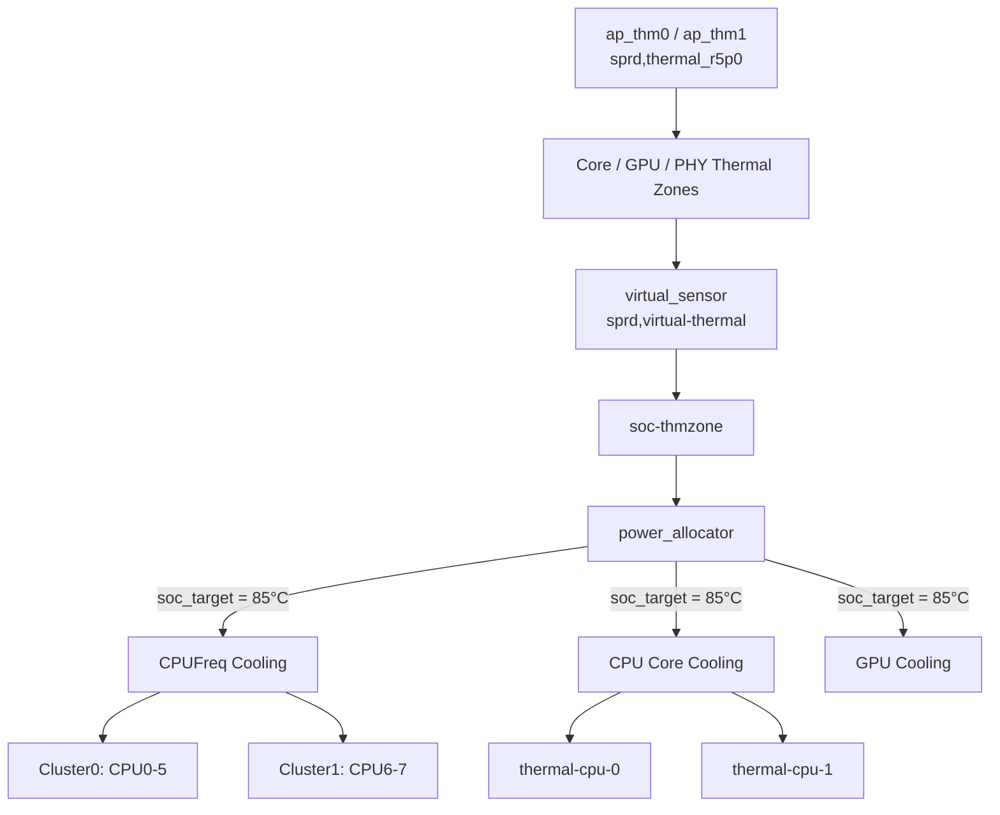
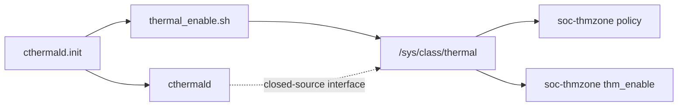
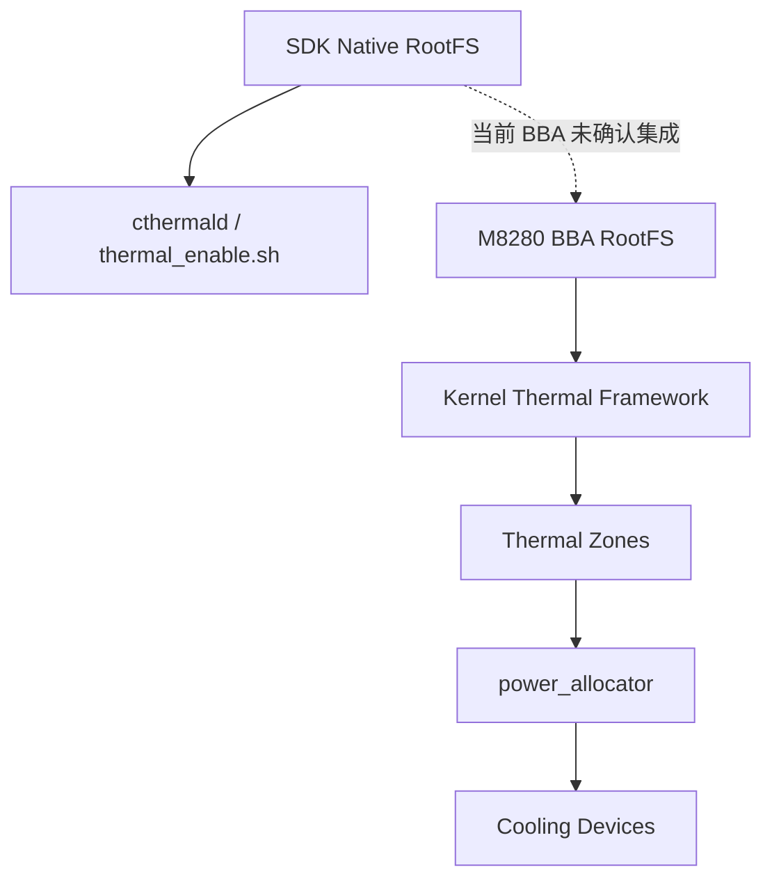
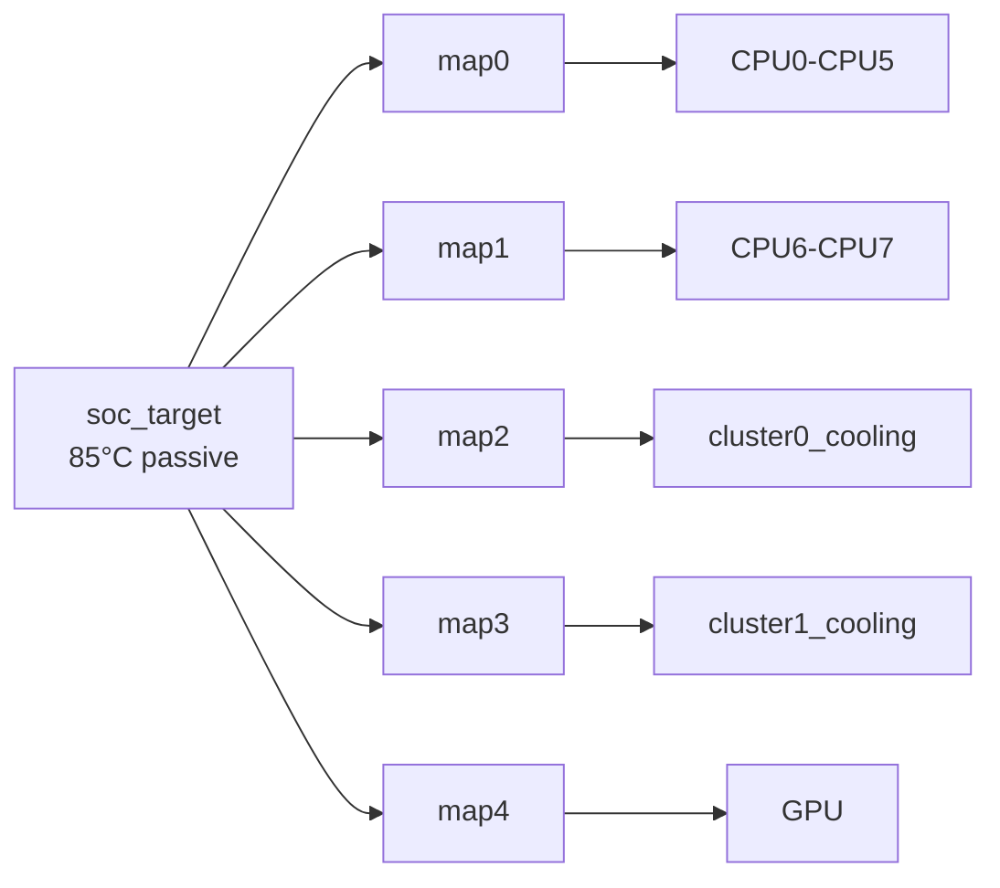
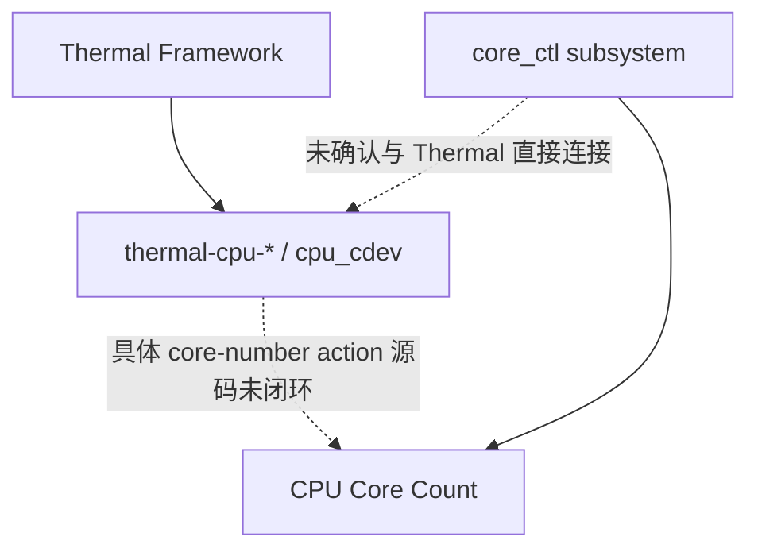
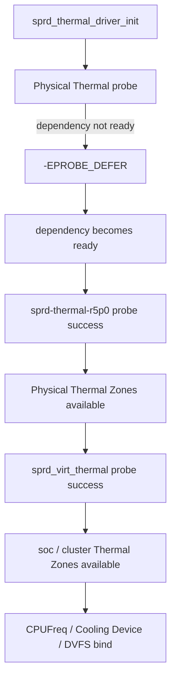

# M8280 / RG258UB_GLAB / UIS8510 v610 SDK Thermal 温控机制

## 目录

- [1. 文档范围与工程基线](#1-文档范围与工程基线)
  - [1.1 文档目标](#11-文档目标)
  - [1.2 当前工程基线](#12-当前工程基线)
  - [1.3 数据源与证据边界](#13-数据源与证据边界)
- [2. Thermal 系统总体架构](#2-thermal-系统总体架构)
  - [2.1 系统组成](#21-系统组成)
  - [2.2 Kernel Thermal 主控制链](#22-kernel-thermal-主控制链)
  - [2.3 SDK Userspace Thermal 组件](#23-sdk-userspace-thermal-组件)
  - [2.4 BBA 当前接入关系](#24-bba-当前接入关系)
- [3. Thermal Sensor 与 Thermal Zone](#3-thermal-sensor-与-thermal-zone)
  - [3.1 SoC Thermal Controller](#31-soc-thermal-controller)
  - [3.2 SoC Physical Thermal Zones](#32-soc-physical-thermal-zones)
  - [3.3 Virtual Thermal Sensor](#33-virtual-thermal-sensor)
  - [3.4 External ADC Thermal Sensor](#34-external-adc-thermal-sensor)
  - [3.5 Runtime Thermal Zone 现状](#35-runtime-thermal-zone-现状)
- [4. SoC Thermal 主控制链](#4-soc-thermal-主控制链)
  - [4.1 soc-thmzone](#41-soc-thmzone)
  - [4.2 Trip 配置](#42-trip-配置)
  - [4.3 power_allocator Governor](#43-power_allocator-governor)
  - [4.4 Cooling Map](#44-cooling-map)
- [5. CPU Thermal Cooling](#5-cpu-thermal-cooling)
  - [5.1 CPU Cluster 与 CPUFreq Policy](#51-cpu-cluster-与-cpufreq-policy)
  - [5.2 CPUFreq Cooling](#52-cpufreq-cooling)
  - [5.3 CPU Core Cooling](#53-cpu-core-cooling)
  - [5.4 cpu_cdev](#54-cpu_cdev)
  - [5.5 core_ctl](#55-core_ctl)
  - [5.6 Thermal Cooling 与 core_ctl 的关系边界](#56-thermal-cooling-与-core_ctl-的关系边界)
- [6. GPU Thermal Cooling](#6-gpu-thermal-cooling)
- [7. External ADC Thermal](#7-external-adc-thermal)
  - [7.1 ADC Thermistor 节点](#71-adc-thermistor-节点)
  - [7.2 温度查表](#72-温度查表)
  - [7.3 Product Hardware 有效性](#73-product-hardware-有效性)
- [8. SDK Userspace Thermal](#8-sdk-userspace-thermal)
  - [8.1 cthermald](#81-cthermald)
  - [8.2 cthermald.init](#82-cthermaldinit)
  - [8.3 thermal_enable.sh](#83-thermal_enablesh)
  - [8.4 thm_enable](#84-thm_enable)
  - [8.5 SDK Native RootFS 与 BBA RootFS](#85-sdk-native-rootfs-与-bba-rootfs)
- [9. Thermal 初始化与 Runtime 建链](#9-thermal-初始化与-runtime-建链)
  - [9.1 Physical Thermal Driver Probe](#91-physical-thermal-driver-probe)
  - [9.2 Virtual Thermal Probe](#92-virtual-thermal-probe)
  - [9.3 Cooling Device 与 CPUFreq 初始化](#93-cooling-device-与-cpufreq-初始化)
  - [9.4 Probe Defer](#94-probe-defer)
- [10. 过温保护机制](#10-过温保护机制)
  - [10.1 Passive Trip](#101-passive-trip)
  - [10.2 Hot Trip](#102-hot-trip)
  - [10.3 Critical Trip](#103-critical-trip)
  - [10.4 Hardware OTP 证据边界](#104-hardware-otp-证据边界)
- [11. Runtime 接口与观测方法](#11-runtime-接口与观测方法)
  - [11.1 Thermal Zone](#111-thermal-zone)
  - [11.2 Cooling Device](#112-cooling-device)
  - [11.3 CPUFreq](#113-cpufreq)
  - [11.4 CPU Core Control](#114-cpu-core-control)
  - [11.5 Kernel Thread 与 Symbol](#115-kernel-thread-与-symbol)
- [12. BBA 产品接入](#12-bba-产品接入)
  - [12.1 Kernel / DTS Overlay](#121-kernel--dts-overlay)
  - [12.2 RootFS 组装](#122-rootfs-组装)
  - [12.3 cthermald 接入状态](#123-cthermald-接入状态)
- [13. 问题定位](#13-问题定位)
  - [13.1 Thermal Zone 未注册](#131-thermal-zone-未注册)
  - [13.2 Cooling Device 未注册](#132-cooling-device-未注册)
  - [13.3 开机出现 Thermal Probe 失败](#133-开机出现-thermal-probe-失败)
  - [13.4 ADC Thermal 温度异常](#134-adc-thermal-温度异常)
  - [13.5 thm_enable 接口异常](#135-thm_enable-接口异常)
  - [13.6 cthermald 不存在](#136-cthermald-不存在)
- [14. 源码、配置与产物索引](#14-源码配置与产物索引)
- [15. 当前证据边界](#15-当前证据边界)

---

# 1. 文档范围与工程基线

## 1.1 文档目标

本文描述 M8280 / UIS8510 / v610 SDK 中的 Thermal 温控机制，建立以下对象之间的工程关系：

- Thermal Sensor；
- Thermal Zone；
- Virtual Thermal Sensor；
- Trip；
- Thermal Governor；
- Cooling Device；
- CPUFreq Cooling；
- CPU Core Cooling；
- GPU Cooling；
- `cpu_cdev`；
- `core_ctl`；
- SDK Native userspace Thermal 组件；
- M8280 BBA RootFS 与启动接入。

本文以当前 New SDK 源码和 M8280 Model 配置为设计基线，以 CNAA 旧 SDK 样板 Runtime 作为历史运行时交叉验证。旧样板 Runtime 仅用于证明 v610 Thermal 对象和接口曾实际运行，不作为当前 GLAB / New SDK Runtime 的完全等价证明。

本文不展开 Linux Thermal Framework 的通用知识，只描述当前工程中已经确认的配置、对象、数据流、控制关系和证据边界。

---

## 1.2 当前工程基线

| 项目 | 当前基线 |
|---|---|
| Product | M8280 |
| Spec | EU |
| Quectel Project | RG258UB_GLAB |
| Revision | RG258UB_GLABR01A01M4G |
| Module | RG258UB-GL |
| SoC | UIS8510 |
| Platform | v610 |
| Kernel | Linux 6.6 |
| Board | 1H10 NAND |
| Storage | 256 MiB SPI NAND |
| BBA | 3.3.0 |
| Workspace | `/home/bba/work/bba/610/bba/3.3.0/bba_3_0_platform` |
| SDK | `sdk/ql_rg620ua` |
| Kernel Source | `sdk/ql_rg620ua/unisoc/linux/kernel_6.6` |
| Model | `platform/build/model/M8280/EU` |
| New SDK Gold Baseline | `fc1b1da38c0b2ea9b327a3c8b7f744c2a96df4f0` |

M8280 Model DTS Overlay：

```text
platform/build/model/M8280/EU/dts/v610.dts
```

当前确认的 Thermal DTS include 关系：

```text
platform/build/model/M8280/EU/dts/v610.dts
├── ums9632/ums9632.dtsi
│   └── thermal.dtsi
├── ums9632/ums9632-1h10-overlay.dtsi
└── STR(QUECTEL_PROJECT_MODEL.dtsi)
```

当前源码检查中，主要 Thermal provider / zone 未发现被 M8280 overlay 通过 `status = "disabled"` 关闭。

该结论表示 Source DTS 中节点默认有效，不等价于当前 GLAB Runtime 已完成 probe。

---

## 1.3 数据源与证据边界

### 当前 New SDK 源码

用于确定当前设计：

- DTS；
- Kernel Kconfig；
- Linux Thermal Framework；
- Generic ADC Thermal；
- BBA Model Overlay；
- SDK staging RootFS；
- BBA filesystem 组装规则。

当前可见源码中未定位以下 vendor 实现：

```text
sprd,thermal_r5p0
sprd,virtual-thermal
sprd,cluster-cooling
```

这些对象的 Runtime 存在性由历史 CNAA 样板交叉验证，但当前 New SDK 源码中的具体 producer 文件尚未闭环。

### CNAA 旧 SDK Runtime

CNAA 样板运行：

```text
Linux M8280 6.6.57-4k
```

该样板确认以下对象实际存在：

```text
sprd-thermal-r5p0
sprd_virt_thermal
soc-thmzone
power_allocator
thm_enable
cpufreq-cpu0
cpufreq-cpu6
thermal-cpu-0
thermal-cpu-1
soc_thm_polling
cpu_cdev0_updat
cpu_cdev1_updat
core_ctl/0
core_ctl/6
```

当前 New SDK DTS 中的 `soc-thmzone`、Trip 和 Cooling Map 与该 Runtime 结构一致。

### 当前 GLAB Runtime

当前 GLAB 样机暂不可用。

以下内容不能由 CNAA 旧 SDK Runtime 直接升级为当前 GLAB Runtime 事实：

- 当前具体温度；
- 当前 Cooling State；
- 当前 CPU OPP；
- 当前 `max_state` 是否完全不变；
- 当前 ADC Thermistor 实际值；
- 当前 boot probe 时序；
- 当前 critical 最终关机动作。

---

# 2. Thermal 系统总体架构

## 2.1 系统组成

v610 Thermal 由 Physical Sensor、Thermal Framework、SoC Policy Zone、Cooling Device 和 SDK userspace 扩展组成。

| 层级 | 主要对象 | 作用 |
|---|---|---|
| SoC Physical Sensor | `ap_thm0`、`ap_thm1` | SoC 内部温度采集 |
| External Sensor | `generic-adc-thermal` | 外部 ADC/NTC 温度采集 |
| Physical Thermal Zone | `core*-thmzone`、`gpu-thmzone`、`thm*phy-thmzone` 等 | 暴露具体硬件温度 |
| Virtual Thermal | `sprd,virtual-thermal` | 基于多个 Physical Thermal Zone 提供虚拟温度 |
| SoC Policy Zone | `soc-thmzone` | SoC 级温控策略入口 |
| Thermal Governor | `power_allocator` | 计算目标 Cooling State |
| CPUFreq Cooling | `cpufreq-cpu0`、`cpufreq-cpu6` | 限制 CPU Cluster 频率 |
| CPU Core Cooling | `thermal-cpu-0`、`thermal-cpu-1` | CPU Cluster Core Cooling |
| GPU Cooling | GPU Cooling Device | GPU Thermal Cooling |
| CPU Resource Control | `core_ctl` | 独立 CPU Core 控制子系统 |
| SDK Userspace | `thermal_enable.sh`、`cthermald` | SDK Native userspace Thermal 扩展 |

Kernel Thermal Framework 构成当前温控主控制链。

`cthermald` 不位于 Kernel Thermal Framework 到 Cooling Device 的必经路径。

---

## 2.2 Kernel Thermal 主控制链

当前 New SDK DTS 与 CNAA 旧 SDK Runtime 共同支持以下结构：



Physical Sensor 负责温度采集。

Physical Thermal Zone 将具体硬件温度注册到 Thermal Framework。

`virtual_sensor` 作为 `soc-thmzone` 的 Thermal Sensor。

`soc-thmzone` 使用 `power_allocator` 作为 Thermal Governor。

当前所有 SoC Cooling Map 均绑定 `soc_target = 85°C`。

---

## 2.3 SDK Userspace Thermal 组件

SDK staging RootFS 中存在：

```text
/usr/bin/cthermald
/usr/bin/thermal_enable.sh
/etc/init.d/cthermald.init
/etc/config/thermal
```

SDK Native userspace 关系：



`thermal_enable.sh` 与 `cthermald` 属于 SDK Native userspace Thermal 扩展。

Kernel Thermal Zone、Trip、Governor 和 Cooling Device 的注册不依赖 `cthermald` 才能完成。

---

## 2.4 BBA 当前接入关系

当前源码检查结果：

```text
SDK staging RootFS
├── /usr/bin/cthermald
├── /usr/bin/thermal_enable.sh
├── /etc/init.d/cthermald.init
└── /etc/config/thermal
```

M8280 BBA source-visible filesystem 未发现上述文件。

当前已检查的 `supplier_fs_bin` 规则也未发现对应导入。

CNAA BBA Runtime 同样未发现 `cthermald`，但 Kernel Thermal 仍正常存在：

```text
25 Thermal Zones
4 Cooling Devices
soc-thmzone
power_allocator
soc_thm_polling
cpu_cdev
core_ctl
```

当前架构应表示为：



---

# 3. Thermal Sensor 与 Thermal Zone

## 3.1 SoC Thermal Controller

当前 Thermal DTS 定义两组 SoC Thermal Controller。

### `ap_thm0`

```dts
ap_thm0: thermal@270000 {
    compatible = "sprd,thermal_r5p0";
    reg = <0x270000 0x10000>;
    clock-names = "enable";
    clocks = <&aonapb_gate CLK_THM0_EB>;
    #thermal-sensor-cells = <1>;
    nvmem-cells = <&thm0_ratio>;
    nvmem-cell-names = "thm_ratio_cal";
};
```

### `ap_thm1`

```dts
ap_thm1: thermal@280000 {
    compatible = "sprd,thermal_r5p0";
    reg = <0x280000 0x10000>;
    clock-names = "enable";
    clocks = <&aonapb_gate CLK_THM1_EB>;
    #thermal-sensor-cells = <1>;
    nvmem-cells = <&thm1_ratio>;
    nvmem-cell-names = "thm_ratio_cal";
};
```

每组 controller 下包含多个 sensor channel，并使用 NVMEM 校准数据。

当前 DTS 未在该节点中看到显式 `interrupt` 属性。

CNAA Runtime 对应的绝对设备地址为：

```text
64270000.thermal
64280000.thermal
```

启动日志确认：

```text
sprd-thermal-r5p0 64270000.thermal: sen id = 0 ...
sprd-thermal-r5p0 64270000.thermal: sen id = 7 ...
probe of 64270000.thermal returned 0

sprd-thermal-r5p0 64280000.thermal: sen id = 0 ...
sprd-thermal-r5p0 64280000.thermal: sen id = 6 ...
probe of 64280000.thermal returned 0
```

结论：

- `sprd,thermal_r5p0` 在 v610 Runtime 中存在实际 driver；
- Physical Thermal Controller 可以成功 probe；
- 当前 New SDK 可见源码尚未定位该 vendor driver 的实现文件。

可见的 `drivers/thermal/sprd_thermal.c` 仅匹配：

```text
sprd,ums512-thermal
```

且当前配置：

```text
# CONFIG_SPRD_THERMAL is not set
```

该文件不能作为当前 `sprd,thermal_r5p0` 的实现来源。

---

## 3.2 SoC Physical Thermal Zones

CNAA Runtime 实际注册的 SoC / CPU / GPU Thermal Zone 包括：

```text
thm0phy-thmzone
core0-thmzone
core1-thmzone
core2-thmzone
core3-thmzone
core4-thmzone
core5-thmzone
cluster-thmzone
gpu-thmzone
mm-thmzone
thm1phy-thmzone
core6-thmzone
core7-thmzone
lte-thmzone
nr-thmzone
cluster0-thmzone
cluster1-thmzone
soc-thmzone
```

除 `soc-thmzone` 外，历史 Runtime 中这些 zone 的 policy 为：

```text
step_wise
```

多数 physical zone 使用统一保护 Trip：

```text
temp=150000
type=hot
hyst=1000
```

这些 Physical Zone 主要承担温度暴露和局部 Thermal 对象注册。

SoC 级策略由独立的 `soc-thmzone` 承担。

---

## 3.3 Virtual Thermal Sensor

当前 `thermal.dtsi` 定义：

```dts
virtual_sensor: virtual-sensor@0 {
    compatible = "sprd,virtual-thermal";
    polling-ms-passive = <100>;
    polling-ms = <1000>;
    step-temperature = <10000>;
    #thermal-sensor-cells = <1>;

    thmzone-cells = <&core0_thmzone>, <&core1_thmzone>,
                    <&core2_thmzone>, <&core3_thmzone>,
                    <&core4_thmzone>, <&core5_thmzone>,
                    <&core6_thmzone>, <&core7_thmzone>,
                    <&gpu_thmzone>;
};
```

当前 Source DTS 确认：

```text
Core0-7 Thermal Zones
          +
     GPU Thermal Zone
          ↓
 sprd,virtual-thermal
          ↓
    virtual_sensor
          ↓
     soc-thmzone
```

CNAA Runtime 确认存在 Virtual Thermal driver：

```text
calling sprd_virt_thm_driver_init

sprd_virt_thermal soc:aon:cluster0-sensor: virt thermal probe success
sprd_virt_thermal soc:aon:cluster1-sensor: virt thermal probe success
```

Kernel symbol 中还存在：

```text
virtual_thermal_init
```

当前证据确认 v610 Runtime 存在 Unisoc Virtual Thermal 层。

当前 New SDK 可见源码尚未定位 `sprd,virtual-thermal` 的具体 driver 文件和 `get_temp()` 实现。

---

## 3.4 External ADC Thermal Sensor

M8280 `v610.dts` 定义多个 `generic-adc-thermal` provider，包括：

```text
ambient_thermistor
tboard_thermistor
rf_234G_thermistor
rf_5G_thermistor
chg_thermistor
usb_thermistor
wcn_thermistor
```

示例：

```dts
ambient_thermistor: ambient-sensor {
    compatible = "generic-adc-thermal";
    #thermal-sensor-cells = <0>;
    io-channels = <&ump9651_adc 0>;
    io-channel-names = "sensor-channel";

    temperature-lookup-table = <
        (-40000) 1131
        ...
        (125000) 43
    >;
};
```

Kernel 配置：

```text
CONFIG_GENERIC_ADC_THERMAL=y
```

对应 driver：

```text
sdk/ql_rg620ua/unisoc/linux/kernel_6.6/drivers/thermal/thermal-generic-adc.c
```

主要调用关系：

```text
compatible = "generic-adc-thermal"
        ↓
gadc_thermal_probe()
        ↓
devm_iio_channel_get()
        ↓
gadc_thermal_read_linear_lookup_table()
        ↓
devm_thermal_of_zone_register()
        ↓
gadc_thermal_get_temp()
        ↓
iio_read_channel_processed()
        ↓
gadc_thermal_adc_to_temp()
```

输出温度单位为 milli-Celsius。

---

## 3.5 Runtime Thermal Zone 现状

CNAA 旧 SDK Runtime 共观察到 25 个 Thermal Zone：

| Zone | Type | Policy | Runtime Trip |
|---|---|---|---|
| zone0 | `ambient-thmzone` | `step_wise` | 150°C hot |
| zone1 | `board-thmzone` | `step_wise` | 150°C hot |
| zone2 | `pa-thmzone` | `step_wise` | 150°C hot |
| zone3 | `pa5g-thmzone` | `step_wise` | 150°C hot |
| zone4 | `chg-thmzone` | `step_wise` | 150°C hot |
| zone5 | `usb-thmzone` | `step_wise` | 150°C hot |
| zone6 | `wcn-thmzone` | `step_wise` | 150°C hot |
| zone7 | `thm0phy-thmzone` | `step_wise` | 150°C hot |
| zone8 | `core0-thmzone` | `step_wise` | 150°C hot |
| zone9 | `core1-thmzone` | `step_wise` | 150°C hot |
| zone10 | `core3-thmzone` | `step_wise` | 150°C hot |
| zone11 | `core4-thmzone` | `step_wise` | 150°C hot |
| zone12 | `cluster-thmzone` | `step_wise` | 150°C hot |
| zone13 | `gpu-thmzone` | `step_wise` | 150°C hot |
| zone14 | `mm-thmzone` | `step_wise` | 150°C hot |
| zone15 | `thm1phy-thmzone` | `step_wise` | 150°C hot |
| zone16 | `core6-thmzone` | `step_wise` | 150°C hot |
| zone17 | `core7-thmzone` | `step_wise` | 150°C hot |
| zone18 | `core2-thmzone` | `step_wise` | 150°C hot |
| zone19 | `core5-thmzone` | `step_wise` | 150°C hot |
| zone20 | `lte-thmzone` | `step_wise` | 150°C hot |
| zone21 | `nr-thmzone` | `step_wise` | 150°C hot |
| zone22 | `cluster0-thmzone` | `step_wise` | 150°C hot |
| zone23 | `cluster1-thmzone` | `step_wise` | 150°C hot |
| zone24 | `soc-thmzone` | `power_allocator` | 70/85/105/115°C |

该 Runtime 与当前 New SDK 的 SoC Thermal DTS 结构一致。

---

# 4. SoC Thermal 主控制链

## 4.1 `soc-thmzone`

当前 Thermal DTS：

```dts
soc_thmzone: soc-thmzone {
    polling-delay-passive = <100>;
    polling-delay = <1000>;

    sustainable-power = <4650>;
    k_po = <80>;
    k_pu = <80>;
    k_i = <32>;
    integral_cutoff = <15000>;

    governor = "power_allocator";
    thermal-sensors = <&virtual_sensor 0>;
};
```

核心属性：

| 属性 | 值 |
|---|---:|
| Thermal Sensor | `virtual_sensor` |
| Governor | `power_allocator` |
| Normal Polling | 1000 ms |
| Passive Polling | 100 ms |
| Sustainable Power | 4650 |

CNAA Runtime：

```text
ZONE=/sys/class/thermal/thermal_zone24

type=soc-thmzone
temp=31070
policy=power_allocator
available_policies=power_allocator user_space step_wise
mode=enabled
thm_enable=1
```

当前 DTS 与历史 Runtime 对 `soc-thmzone` 名称、Governor 和 Trip 配置一致。

---

## 4.2 Trip 配置

`soc-thmzone` 配置四个 Trip：

| Trip | Temperature | Hysteresis | Type | DTS Cooling Map |
|---|---:|---:|---|---|
| `soc_threshold` | 70°C | 1°C | passive | 无 |
| `soc_target` | 85°C | 1°C | passive | 有 |
| `soc_hot` | 105°C | 2°C | hot | 无 |
| `soc_crit` | 115°C | 2°C | critical | 无 |

CNAA Runtime：

```text
trip_point_0
  temp=70000
  type=passive
  hyst=1000

trip_point_1
  temp=85000
  type=passive
  hyst=1000

trip_point_2
  temp=105000
  type=hot
  hyst=2000

trip_point_3
  temp=115000
  type=critical
  hyst=2000
```

四个 Trip 不能解释为四组逐级 Cooling Map。

当前 DTS 中只有：

```text
soc_target = 85°C
```

被 Cooling Map 直接引用。

---

## 4.3 `power_allocator` Governor

当前 `soc-thmzone` 显式指定：

```dts
governor = "power_allocator";
```

Kernel 配置：

```text
CONFIG_THERMAL_GOV_POWER_ALLOCATOR=y
```

CNAA Runtime：

```text
soc-thmzone:
policy=power_allocator
```

普通 Physical Thermal Zone 的 Runtime policy 为：

```text
step_wise
```

当前层级关系：

```text
Physical Thermal Zones
        │
        └── step_wise
              │
              ▼
       virtual_sensor
              │
              ▼
        soc-thmzone
              │
       power_allocator
```

Thermal Governor 与 CPUFreq Governor 属于不同层级。

CNAA CPUFreq Runtime：

```text
policy0:
scaling_driver=sprd-cpufreq-v2
scaling_governor=uscfreq

policy6:
scaling_driver=sprd-cpufreq-v2
scaling_governor=uscfreq
```

关系为：

```text
Thermal Governor
power_allocator
        ↓
决定 Thermal Cooling State

CPUFreq Driver / Governor
sprd-cpufreq-v2 + uscfreq
        ↓
执行 CPU DVFS
```

Thermal Cooling 对 CPUFreq 施加 Thermal 约束，不替代 `uscfreq`。

---

## 4.4 Cooling Map

当前 `soc-thmzone` 中所有 Cooling Map 均绑定：

```dts
trip = <&soc_target>;
```

对应温度：

```text
85°C
```

关系：



当前 Trip → Cooling Map 对应关系：

| Trip | Cooling Device |
|---|---|
| `soc_threshold` 70°C | 无直接 DTS Cooling Map |
| `soc_target` 85°C | CPU0-5、CPU6-7、cluster0、cluster1、GPU |
| `soc_hot` 105°C | 无直接 DTS Cooling Map |
| `soc_crit` 115°C | 无直接 DTS Cooling Map |

CPU Cooling Map 的 state 范围使用：

```text
THERMAL_NO_LIMIT
```

具体 state 数量由实际 Cooling Device 注册结果提供。

---

# 5. CPU Thermal Cooling

## 5.1 CPU Cluster 与 CPUFreq Policy

当前平台 CPU 分为两组：

```text
Cluster 0
CPU0-CPU5

Cluster 1
CPU6-CPU7
```

CNAA Runtime CPUFreq Policy：

```text
policy0:
affected_cpus=0 1 2 3 4 5
related_cpus=0 1 2 3 4 5
scaling_driver=sprd-cpufreq-v2
scaling_governor=uscfreq

policy6:
affected_cpus=6 7
related_cpus=6 7
scaling_driver=sprd-cpufreq-v2
scaling_governor=uscfreq
```

该 Runtime 与 DTS cluster 划分一致。

---

## 5.2 CPUFreq Cooling

Kernel 配置：

```text
CONFIG_CPU_THERMAL=y
CONFIG_CPU_FREQ_THERMAL=y
```

Thermal Makefile：

```make
thermal_sys-$(CONFIG_CPU_FREQ_THERMAL) += cpufreq_cooling.o
```

CNAA Runtime 注册两个 CPUFreq Cooling Device：

```text
cooling_device0
  type=cpufreq-cpu0
  cur_state=0
  max_state=14

cooling_device1
  type=cpufreq-cpu6
  cur_state=0
  max_state=15
```

对应关系：

| Cluster | CPUs | CPUFreq Policy | Cooling Device |
|---|---|---|---|
| Cluster 0 | CPU0-CPU5 | `policy0` | `cpufreq-cpu0` |
| Cluster 1 | CPU6-CPU7 | `policy6` | `cpufreq-cpu6` |

CNAA Runtime 频率范围：

```text
Cluster 0
min = 614400
max = 2041000

Cluster 1
min = 614400
max = 2210000
```

该频率值属于旧 SDK Runtime Snapshot，不作为当前 GLAB / New SDK 固定参数。

CPUFreq Cooling 的工程作用是将 Thermal Cooling State 映射为 CPUFreq 约束。

当前 New SDK 可见源码尚未闭环当前 DTS CPU phandle 到 CPUFreq Cooling registration 的 vendor 调用点；历史 Runtime 已确认对应 Cooling Device 实际存在。

---

## 5.3 CPU Core Cooling

当前 DTS 还定义：

```text
cluster0_cooling
cluster1_cooling
```

示例属性：

```dts
compatible = "sprd,cluster-cooling";
#cooling-cells = <2>;
thermal-cluster-cpumask = <...>;
sprd,hotplug-period = <10>;
sprd,min-cpufreq = <614400>;
sprd,min-cpunum = <...>;
sprd,max-temp = <...>;
```

Cluster0：

```text
cpumask = 0x3f
CPU0-CPU5
min-cpufreq = 614400
min-cpunum = 1
```

Cluster1：

```text
cpumask = 0xc0
CPU6-CPU7
min-cpufreq = 614400
min-cpunum = 0
```

CNAA Runtime 注册：

```text
cooling_device2
  type=thermal-cpu-0
  cur_state=0
  max_state=6

cooling_device3
  type=thermal-cpu-1
  cur_state=0
  max_state=2
```

`max_state` 与两组 Cluster 的 CPU 数量一致：

```text
Cluster0 = 6 CPUs → max_state=6
Cluster1 = 2 CPUs → max_state=2
```

同时 Runtime 存在：

```text
[cpu_cdev0_updat]
[cpu_cdev1_updat]
```

Kernel symbol：

```text
cpu_cdev_update_task_fn
```

当前证据支持 `thermal-cpu-*` 与 Cluster CPU Core 数量控制相关。

由于当前可见 New SDK source 未定位对应 vendor `set_cur_state()` 实现，本文不定义 Cooling State 到在线 CPU 数量的精确转换公式。

---

## 5.4 `cpu_cdev`

历史 Runtime 确认：

```text
[cpu_cdev0_updat]
[cpu_cdev1_updat]
```

Kernel symbol：

```text
cpu_cdev_update_task_fn
```

对应 Cooling Device：

```text
thermal-cpu-0
thermal-cpu-1
```

当前状态应区分为：

```text
Runtime existence:
CONFIRMED

Current visible source implementation:
NOT FOUND
```

`cpu_cdev` 不能再标记为“机制是否存在 UNKNOWN”。

未闭环的是具体源码 Producer 和 state-to-action 细节。

---

## 5.5 `core_ctl`

CNAA Runtime 线程：

```text
[core_ctl/0]
[core_ctl/6]
```

sysfs：

```text
/sys/devices/system/cpu/cpu0/core_ctl
/sys/devices/system/cpu/cpu6/core_ctl
```

Kernel symbol：

```text
core_ctl_qos_add_request
core_ctl_qos_update_request
core_ctl_qos_remove_request
core_ctl_check
core_ctl_init
do_core_ctl
try_core_ctl
```

历史 Runtime 状态：

### Cluster0

```text
enable=0
min_cpus=4
max_cpus=6
active_cpus=6
```

### Cluster1

```text
enable=0
min_cpus=2
max_cpus=2
active_cpus=2
```

当时 CPU0-CPU7 均 online。

结论：

- v610 Kernel Runtime 存在完整 `core_ctl` 子系统；
- CNAA Runtime 中两个 `core_ctl` group 均为 `enable=0`；
- 当前没有证据证明 `soc-thmzone` 或 `cpu_cdev` 直接调用 `core_ctl`。

---

## 5.6 Thermal Cooling 与 `core_ctl` 的关系边界

当前不能将以下关系写成事实：

```text
Thermal
  ↓
core_ctl
  ↓
CPU Hotplug
```

当前证据支持的表达：



`cpu_cdev` 和 `core_ctl` 均真实存在，但二者之间是否存在直接函数调用、QoS 请求或其他耦合，当前证据不足。

---

# 6. GPU Thermal Cooling

当前 `soc_target` Cooling Map 包含 GPU：

```dts
map4 {
    trip = <&soc_target>;
    contribution = <1024>;
    cooling-device =
        <&gpu THERMAL_NO_LIMIT THERMAL_NO_LIMIT>;
};
```

`virtual_sensor` 同时引用：

```text
gpu_thmzone
```

当前结构：

```text
GPU Temperature
      ↓
gpu-thmzone
      ↓
virtual_sensor
      ↓
soc-thmzone
      ↓
power_allocator
      ↓
GPU Cooling Device
```

当前可见源码尚未闭环 GPU Cooling Device 的 registration 和 state-to-frequency / state-to-power 实现。

本文不补充 GPU 内部 DVFS 机制。

---

# 7. External ADC Thermal

## 7.1 ADC Thermistor 节点

当前 M8280 DTS 中存在：

```text
ambient_thermistor
tboard_thermistor
rf_234G_thermistor
rf_5G_thermistor
chg_thermistor
usb_thermistor
wcn_thermistor
```

对应 Thermal Zone 包括：

```text
ambient-thmzone
board-thmzone
pa-thmzone
pa5g-thmzone
chg-thmzone
usb-thmzone
wcn-thmzone
```

当前 Runtime 还存在其他板级 thermal zone，如 front/back/bkchg/frame/skin 等；其最终产品硬件来源需以对应 DTS 与板级连接为准。

---

## 7.2 温度查表

`generic-adc-thermal` 通过 IIO 读取 ADC processed value，再通过 DTS lookup table 转为 milli-Celsius。

数据链：

```text
External Thermistor
        ↓
UMP9651 ADC
        ↓
IIO Channel
        ↓
generic-adc-thermal
        ↓
Temperature Lookup Table
        ↓
Thermal Zone
```

该路径属于标准可见源码，可直接追踪到：

```text
gadc_thermal_probe()
gadc_thermal_get_temp()
gadc_thermal_adc_to_temp()
```

---

## 7.3 Product Hardware 有效性

CNAA Runtime 曾观察到：

```text
ambient ≈ 111°C
pa      ≈ 61°C
chg     ≈ -40°C
usb     ≈ 125°C
wcn     ≈ 125°C
```

同时 SoC Core 温度约为 28-31°C。

该现象说明：

```text
Thermal Zone 注册成功
```

与：

```text
对应板级 Thermistor 硬件有效
```

是两个不同问题。

可能影响 External ADC Thermal 值的因素包括：

- 样板是否实际连接对应 NTC；
- ADC channel 的板级连接；
- 电阻网络；
- lookup table 与实际器件是否匹配；
- 板型差异。

当前数据源不能确定 CNAA 异常值的具体原因。

因此这些历史数值只作为 Debug 现象，不作为产品正常工作温度。

---

# 8. SDK Userspace Thermal

## 8.1 `cthermald`

SDK staging RootFS 存在：

```text
/usr/bin/cthermald
```

当前可见 workspace 未找到对应源码，按闭源组件处理。

当前不能从 binary 名称推导其内部状态机、算法、CPUFreq 控制或关机逻辑。

安全边界：

```text
cthermald
   ↓
closed-source boundary
```

可确认其启动入口和同一 SDK Thermal userspace 组件使用的 sysfs 接口，但不能确认 binary 内部具体使用哪些接口。

---

## 8.2 `cthermald.init`

SDK init script：

```sh
START=21
STOP=15
USE_PROCD=1
PROG=/usr/bin/cthermald

start_service() {
    sh /usr/bin/thermal_enable.sh

    procd_open_instance
    procd_set_param command ${PROG}
    procd_set_param respawn
    procd_close_instance
}
```

启动顺序：

```text
cthermald.init
      ↓
thermal_enable.sh
      ↓
procd start cthermald
```

`respawn` 表示 SDK Native 环境期望 `cthermald` 作为常驻进程运行。

---

## 8.3 `thermal_enable.sh`

脚本逻辑：

1. 读取 UCI `thermal.ap.enable`；
2. 枚举 `/sys/class/thermal/thermal_zone*`；
3. 根据 `type` 查找 `soc-thmzone` 或 `cpu-thmzone`；
4. 设置 policy；
5. 打开 vendor `thm_enable`。

核心操作：

```sh
echo power_allocator > /sys/class/thermal/$soc_tz/policy
echo 1 > /sys/class/thermal/$soc_tz/thm_enable
```

这说明 SDK Native userspace 不负责创建 Thermal Zone，而是基于已经存在的 Kernel Thermal sysfs 调整 SoC Thermal policy / enable 状态。

---

## 8.4 `thm_enable`

当前 New SDK 可见源码未定位 `thm_enable` sysfs attribute producer。

CNAA Runtime 已确认：

```text
soc-thmzone
thm_enable=1
```

Kernel symbol：

```text
thm_enable_store
thm_enable_show
```

因此可以确认：

```text
thermal_enable.sh
      ↓
/sys/class/thermal/<soc-zone>/thm_enable
      ↓
vendor Thermal sysfs extension
```

当前未闭环的是该扩展在 New SDK source tree 中的实现文件。

---

## 8.5 SDK Native RootFS 与 BBA RootFS

SDK Native RootFS：

```text
cthermald                  存在
cthermald.init             存在
thermal_enable.sh          存在
/etc/config/thermal        存在
```

M8280 BBA source-visible filesystem：

```text
cthermald                  未发现
cthermald.init             未发现
thermal_enable.sh          未发现
/etc/config/thermal        未发现
```

CNAA BBA Runtime：

```text
cthermald process          未发现
cthermald binary           未发现
thermal_enable.sh          未发现
cthermald.init             未发现
thermal config             未发现
```

但 Kernel Runtime Thermal 正常存在。

因此：

> Kernel Thermal Framework 是 BBA 温控主机制；SDK Native `cthermald` 不是 Kernel Thermal 工作的必需组件。

当前 GLAB 最终 RootFS 仍需以后续正式构建产物验证是否存在额外 late injection。

---

# 9. Thermal 初始化与 Runtime 建链

## 9.1 Physical Thermal Driver Probe

CNAA boot log：

```text
calling sprd_thermal_driver_init
probe of 64270000.thermal returned -517
probe of 64280000.thermal returned -517
```

随后重新 probe：

```text
sprd-thermal-r5p0 64270000.thermal: sen id = 0 ...
...
probe of 64270000.thermal returned 0

sprd-thermal-r5p0 64280000.thermal: sen id = 0 ...
...
probe of 64280000.thermal returned 0
```

`-517` 对应 deferred probe。

Physical Thermal Controller 在依赖满足后能够完成注册。

---

## 9.2 Virtual Thermal Probe

Early stage：

```text
calling sprd_virt_thm_driver_init
sprd_virt_thermal soc:aon:cluster0-sensor: failed to get thermal zone by name
sprd_virt_thermal soc:aon:cluster1-sensor: failed to get thermal zone by name
```

Physical Sensor 注册完成后：

```text
sprd_virt_thermal soc:aon:cluster0-sensor: virt thermal probe success
sprd_virt_thermal soc:aon:cluster1-sensor: virt thermal probe success
```

说明 Virtual Thermal 对下游 Physical Thermal Zone 存在初始化依赖。

---

## 9.3 Cooling Device 与 CPUFreq 初始化

Early stage：

```text
sprd_cpufreq_cooling: Failed to get soc-thmzone or cpu-thmzone
```

后续：

```text
sprd-apcpu-dvfs: register cpufreq driver success
core_ctl: Creating CPU group 0
core_ctl: Creating CPU group 6
...
sprd-apcpu-dvfs: get cluster 0 thmzone successfully
sprd-apcpu-dvfs: get cluster 1 thmzone successfully
```

最终 Runtime 存在：

```text
cpufreq-cpu0
cpufreq-cpu6
thermal-cpu-0
thermal-cpu-1
```

说明早期一次 `Failed to get thermal zone` 不等价于最终 Thermal Cooling 初始化失败。

---

## 9.4 Probe Defer

当前 Runtime 初始化顺序可整理为：



排查启动异常时，应同时检查 early failure 和后续 probe success，不能仅依据前几秒日志判断 Thermal 最终状态。

---

# 10. 过温保护机制

## 10.1 Passive Trip

当前 `soc-thmzone` 有两个 passive Trip：

```text
70°C  soc_threshold
85°C  soc_target
```

当前 DTS 只有 `soc_target` 被 Cooling Map 直接引用。

因此本文不将 70°C 描述为一个独立 Cooling Device 启动档位。

---

## 10.2 Hot Trip

```text
soc_hot = 105°C
hysteresis = 2°C
type = hot
```

当前 DTS 未给 `soc_hot` 配置 Cooling Map。

本文只记录该 Trip 的存在，不补充未确认的 vendor hot handler 行为。

---

## 10.3 Critical Trip

```text
soc_crit = 115°C
hysteresis = 2°C
type = critical
```

该 Trip 不经过 `soc_target` Cooling Map。

Linux Thermal Framework 的 critical path 与具体平台最终关机路径需要区分。

当前数据源尚未确认当前 v610 `soc_crit` 最终执行：

```text
orderly poweroff
kernel poweroff
emergency restart
PMIC hardware shutdown
其他 vendor path
```

因此本文不写死 115°C 后的最终关机 API。

---

## 10.4 Hardware OTP 证据边界

当前可见 `sprd_thermal.c` 中存在：

```text
SPRD_THM_OTP_TEMP = 120000
```

并包含 PMIC 自动 shutdown 相关逻辑说明。

但该 driver：

```text
compatible = "sprd,ums512-thermal"
```

且：

```text
CONFIG_SPRD_THERMAL is not set
```

当前 v610 DTS 使用：

```text
sprd,thermal_r5p0
```

因此不能将该 120°C OTP / PMIC shutdown 路径直接归入当前 M8280 Thermal 实现。

---

# 11. Runtime 接口与观测方法

## 11.1 Thermal Zone

主要路径：

```text
/sys/class/thermal/thermal_zone*
```

关键属性：

```text
type
temp
policy
available_policies
mode
trip_point_*_temp
trip_point_*_type
trip_point_*_hyst
thm_enable
```

`thm_enable` 不是所有 zone 都存在。

CNAA Runtime 中只有 `soc-thmzone` 观察到：

```text
thm_enable=1
```

---

## 11.2 Cooling Device

路径：

```text
/sys/class/thermal/cooling_device*
```

关键属性：

```text
type
cur_state
max_state
```

CNAA Runtime：

| Cooling Device | Type | Max State |
|---|---|---:|
| 0 | `cpufreq-cpu0` | 14 |
| 1 | `cpufreq-cpu6` | 15 |
| 2 | `thermal-cpu-0` | 6 |
| 3 | `thermal-cpu-1` | 2 |

这些值属于旧 SDK Runtime Snapshot。

---

## 11.3 CPUFreq

路径：

```text
/sys/devices/system/cpu/cpufreq/policy*
```

关键属性：

```text
affected_cpus
related_cpus
scaling_driver
scaling_governor
scaling_cur_freq
scaling_min_freq
scaling_max_freq
cpuinfo_min_freq
cpuinfo_max_freq
cpuinfo_cur_freq
```

用于确认：

- Cluster 与 policy 对应关系；
- Thermal Cooling 介入时的频率上限变化；
- CPUFreq driver / governor 状态。

---

## 11.4 CPU Core Control

路径：

```text
/sys/devices/system/cpu/cpu0/core_ctl
/sys/devices/system/cpu/cpu6/core_ctl
```

关键属性：

```text
enable
min_cpus
max_cpus
active_cpus
busy_up_thres
busy_down_thres
user_max_cpus
```

CPU online：

```text
/sys/devices/system/cpu/cpu*/online
```

`core_ctl` 只能证明 CPU Core Control 子系统存在，不能单独证明 Thermal 直接调用该子系统。

---

## 11.5 Kernel Thread 与 Symbol

历史 Runtime 线程：

```text
soc_thm_polling
cpu_cdev0_updat
cpu_cdev1_updat
core_ctl/0
core_ctl/6
```

历史 Runtime `/proc/kallsyms`：

```text
core_ctl_qos_add_request
core_ctl_qos_update_request
core_ctl_qos_remove_request
core_ctl_check
core_ctl_init
thm_enable_store
thm_enable_show
cpu_cdev_update_task_fn
do_core_ctl
try_core_ctl
virtual_thermal_init
```

这些符号证明相关 Kernel 机制在历史 v610 Runtime 中真实存在。

---

# 12. BBA 产品接入

## 12.1 Kernel / DTS Overlay

M8280 Thermal 设计来源于 SDK DTS 与 Model Overlay：

```text
platform/build/model/M8280/EU/dts/v610.dts
        ↓
SDK UIS8510 / UMS9632 DTS include chain
        ↓
uis8510-1h10-nand.dtb
```

当前源码检查未发现 M8280 overlay 关闭：

```text
ap_thm0
ap_thm1
virtual_sensor
soc-thmzone
主要 generic-adc-thermal nodes
```

当前正式生成 DTB 尚未在本次 Thermal 取证中重新解包验证。

---

## 12.2 RootFS 组装

BBA 不是直接使用 SDK Native RootFS。

当前主要组装关系：

```text
SDK package / staging RootFS
        ↓
BBA supplier import
        ↓
platform/targets/M8280/EU/filesystem
        ↓
最终 RootFS
```

与 Thermal userspace 相关的主要检查入口：

```text
platform/build/makes/Makefile.sdk.quecopen_rg620ua.mk
platform/targets/M8280/EU/filesystem
platform/build/model/M8280/EU/rcS
platform/build/model/M8280/EU/rcS.quecopen_rg620ua
```

---

## 12.3 `cthermald` 接入状态

当前证据：

```text
SDK staging RootFS                有 cthermald
M8280 BBA source-visible FS       未发现 cthermald
supplier_fs_bin 已检查分支        未发现导入
M8280 BBA startup scripts         未发现启动
CNAA BBA Runtime                  未发现 cthermald
```

当前 Source-level 结论：

> M8280 BBA 当前已检查的 RootFS 接入链不包含 SDK Native `cthermald` 组件。

当前 GLAB 最终镜像是否存在未检查的外部后处理注入，需要最终 `root.squashfs` 或 Runtime 再确认。

该未知项不影响 Kernel Thermal 主链成立。

---

# 13. 问题定位

## 13.1 Thermal Zone 未注册

优先确认：

```text
/sys/class/thermal/thermal_zone*
```

再检查：

```text
dmesg | grep -i thermal
dmesg | grep -i thm
```

重点关注：

```text
sprd-thermal-r5p0 probe
sprd_virt_thermal probe
failed to get thermal zone by name
```

如果 Physical Sensor 未成功 probe，Virtual Thermal 和 `soc-thmzone` 可能无法完成后续建链。

---

## 13.2 Cooling Device 未注册

检查：

```text
/sys/class/thermal/cooling_device*
```

目标类型：

```text
cpufreq-cpu0
cpufreq-cpu6
thermal-cpu-0
thermal-cpu-1
```

若 `soc-thmzone` 已存在但 Cooling Device 缺失，需要继续检查：

- CPUFreq driver 是否成功注册；
- cluster cooling vendor driver 是否存在；
- Thermal cooling binding 是否晚于 zone 注册完成；
- 是否存在 probe defer 后未重试成功。

---

## 13.3 开机出现 Thermal Probe 失败

历史 Runtime 曾出现：

```text
probe of 64270000.thermal returned -517
probe of 64280000.thermal returned -517
```

以及：

```text
sprd_cpufreq_cooling: Failed to get soc-thmzone or cpu-thmzone
```

随后又出现：

```text
probe ... returned 0
virt thermal probe success
get cluster 0 thmzone successfully
get cluster 1 thmzone successfully
```

因此启动早期一次失败不能单独作为最终 Thermal 功能异常的结论。

问题定位必须同时检查：

```text
Early probe failure
        +
Later probe success/failure
        +
Final sysfs objects
```

---

## 13.4 ADC Thermal 温度异常

如果 `ambient`、`usb`、`wcn` 等 zone 显示接近 lookup table 边界的异常值，应优先检查：

1. 该产品是否实际焊接对应 NTC；
2. DTS `io-channels` 是否与硬件连接一致；
3. ADC 原始值；
4. NTC 阻值曲线；
5. DTS lookup table；
6. 板型差异。

Thermal Zone 存在只能证明 software registration 成功，不能证明传感器硬件有效。

---

## 13.5 `thm_enable` 接口异常

SDK Native `thermal_enable.sh` 依赖：

```text
/sys/class/thermal/<soc-zone>/thm_enable
```

如果脚本写入失败：

1. 确认 `soc-thmzone` 是否存在；
2. 确认该 zone 是否存在 `thm_enable`；
3. 检查 `thm_enable_store` 是否存在于当前 Kernel symbol；
4. 确认 Kernel 与 SDK userspace 是否来自匹配基线。

CNAA Runtime 已确认 v610 vendor Kernel 存在该接口。

---

## 13.6 `cthermald` 不存在

M8280 BBA 中找不到 `cthermald` 时，不应直接判断 Thermal 功能缺失。

应首先检查 Kernel Thermal 主链：

```text
thermal_zone*
cooling_device*
soc-thmzone
power_allocator
CPUFreq cooling
cpu_cdev
```

CNAA BBA Runtime 已证明没有 `cthermald` 时 Kernel Thermal 仍可正常运行。

---

# 14. 源码、配置与产物索引

## Model / Product

```text
platform/build/model/M8280/EU/config.sdk
platform/build/model/M8280/EU/config.kernel
platform/build/model/M8280/EU/dts/v610.dts
platform/build/model/M8280/EU/rcS
platform/build/model/M8280/EU/rcS.quecopen_rg620ua
```

## SDK Thermal Config

```text
sdk/ql_rg620ua/target/linux/unisoc/v610/config-default-nand
```

主要配置：

```text
CONFIG_THERMAL=y
CONFIG_THERMAL_NETLINK=y
CONFIG_THERMAL_STATISTICS=y
CONFIG_THERMAL_OF=y
CONFIG_THERMAL_WRITABLE_TRIPS=y
CONFIG_THERMAL_DEFAULT_GOV_STEP_WISE=y
CONFIG_THERMAL_GOV_STEP_WISE=y
CONFIG_THERMAL_GOV_USER_SPACE=y
CONFIG_THERMAL_GOV_POWER_ALLOCATOR=y
CONFIG_CPU_THERMAL=y
CONFIG_CPU_FREQ_THERMAL=y
CONFIG_DEVFREQ_THERMAL=y
CONFIG_THERMAL_EMULATION=y
CONFIG_GENERIC_ADC_THERMAL=y
# CONFIG_SPRD_THERMAL is not set
```

## Kernel DTS

```text
sdk/ql_rg620ua/unisoc/linux/kernel_6.6/arch/arm64/boot/dts/sprd/
```

当前 Thermal include 主要涉及：

```text
ums9632/ums9632.dtsi
ums9632/thermal.dtsi
ums9632/ums9632-1h10-overlay.dtsi
```

## Linux Thermal Framework

```text
sdk/ql_rg620ua/unisoc/linux/kernel_6.6/drivers/thermal/
```

当前已确认关注文件：

```text
thermal_core.c
gov_step_wise.c
gov_power_allocator.c
cpufreq_cooling.c
thermal-generic-adc.c
sprd_thermal.c    # 可见但不是当前 thermal_r5p0 已证实实现
```

## SDK Native Thermal Userspace

当前 staging RootFS 已确认：

```text
/usr/bin/cthermald
/usr/bin/thermal_enable.sh
/etc/init.d/cthermald.init
/etc/config/thermal
```

Package metadata 中观察到：

```text
thermal2
```

当前尚未闭环 `thermal2` 与 `cthermald` install recipe 的完整 provenance。

## BBA RootFS Integration

```text
platform/build/makes/Makefile.sdk.quecopen_rg620ua.mk
platform/targets/M8280/EU/filesystem
```

---

# 15. 当前证据边界

当前 Thermal 主机制已经能够建立完整工程模型：

```text
Physical Thermal Sensor
        ↓
Physical Thermal Zone
        ↓
Virtual Thermal
        ↓
soc-thmzone
        ↓
power_allocator
        ↓
soc_target @ 85°C
        ↓
CPUFreq / CPU Core / GPU Cooling
```

当前已确认：

1. `ap_thm0` / `ap_thm1` 的 DTS 定义；
2. `sprd,thermal_r5p0` 在历史 v610 Runtime 中实际 probe 成功；
3. Physical Core / GPU Thermal Zone 实际存在；
4. `sprd,virtual-thermal` Runtime 实际存在；
5. `soc-thmzone` 使用 `power_allocator`；
6. 70/85/105/115°C Trip；
7. 所有 SoC Cooling Map 只绑定 `soc_target = 85°C`；
8. CPUFreq Cooling Device 实际存在；
9. CPU Core Cooling Device 实际存在；
10. `cpu_cdev` Runtime 实际存在；
11. `core_ctl` Runtime 实际存在；
12. `thm_enable` Runtime 实际存在；
13. SDK Native RootFS 存在 `cthermald`；
14. M8280 BBA 当前已检查接入链未包含 `cthermald`；
15. 没有 `cthermald` 时 Kernel Thermal 主链仍可正常运行。

当前未完全闭环：

1. 当前 New SDK `sprd,thermal_r5p0` vendor source 文件；
2. 当前 New SDK `sprd,virtual-thermal` vendor source 文件；
3. `sprd,cluster-cooling` 的 `set_cur_state()` 实现；
4. `thermal-cpu-*` state 到 CPU Core 数量的精确转换公式；
5. `cpu_cdev` 与 `core_ctl` 是否存在直接调用关系；
6. GPU Cooling Device 的具体 registration 和 state-to-action；
7. 115°C critical Trip 的最终软件/硬件关机路径；
8. 当前 GLAB / New SDK Runtime 的最终 Thermal sysfs 快照；
9. 当前 Gold SDK commit 与 M8280 Thermal 的精确 Git delta；
10. 当前正式生成 DTB 与 Source DTS 的最终解包一致性。

这些未闭环项不影响当前 Thermal 主流程、Trip、Governor 和主要 Cooling 架构的描述。

---

# 结论

M8280 / UIS8510 v610 的温控主机制位于 Kernel Thermal Framework。

当前 SoC 温度由 Physical Thermal Controller 和 Physical Thermal Zone 提供，Virtual Thermal 层将 Core / GPU Thermal 信息组织为 `soc-thmzone` 的输入。`soc-thmzone` 使用 `power_allocator`，并在 `soc_target = 85°C` 上绑定 CPUFreq、CPU Core 和 GPU Cooling Device。

CPU Thermal 不是单一“降频”机制。历史 Runtime 同时存在：

```text
cpufreq-cpu0 / cpufreq-cpu6
thermal-cpu-0 / thermal-cpu-1
```

前者对应 CPU Frequency Cooling；后者与 Cluster CPU Core Cooling 相关。

`core_ctl` 是平台中真实存在的 CPU Core Control 子系统，但当前没有证据证明它是 Thermal Cooling 的直接执行后端，因此不纳入 Thermal 主控制链。

SDK Native RootFS 另外提供 `thermal_enable.sh` 和闭源 `cthermald`。该 userspace 层可操作 Thermal sysfs，但不是 Kernel Thermal Framework 到 Cooling Device 的必经环节。当前 M8280 BBA 已检查的 RootFS 接入链未集成该组件，历史 CNAA BBA Runtime 也证明 Kernel Thermal 可以在没有 `cthermald` 的情况下正常建立 Thermal Zone 和 Cooling Device。
